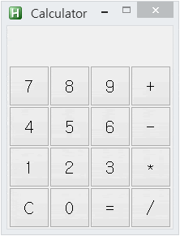

# [My Auto Hot Key Practice](../README.md#my-auto-hot-key-practice)

Boys be ambitious …… !


### \<List>

- [GUI Calculator (2024.01.13)](#gui-calculator-20240113)
- [Hello World (2022.09.03)](#hello-world-20220903)
- [Infinity (2021.12.07)](#infinity-20211207)


## [GUI Calculator (2024.01.13)](#list)

- A Practice of GUI coding with *AutoHotKey*

  

- Future Improvements
  - Improved design: Add colors, fonts, etc.
  - When `A opr. B opr.` is entered, immediately provide calculation results of `A opr. B`

- Code
  <details>
    <summary>GUICalculator.ahk</summary>

  ```ahk
  ; Test mode

  Test := false
  ```
  ```ahk
  ; Set GUI

  if  (Test = true)
  {
    Gui, Add, Text, x2 y2 w200 h20 vDisplayText,              ; Display box
    Gui, Add, Text, x2 y22 w200 h20 vDebugText,               ; Debug box
  }
  else
  {
    Gui, Font, s20
    Gui, Add, Text, x12 y9 w180 h40 vDisplayText,             ; Display box
  }

  Gui, Font, s16
  Gui, Add, Button, x2 y49 w50 h50 gBtn, 7
  Gui, Add, Button, x52 y49 w50 h50 gBtn, 8
  Gui, Add, Button, x102 y49 w50 h50 gBtn, 9
  Gui, Add, Button, x152 y49 w50 h50 gBtn, +

  Gui, Add, Button, x2 y99 w50 h50 gBtn, 4
  Gui, Add, Button, x52 y99 w50 h50 gBtn, 5
  Gui, Add, Button, x102 y99 w50 h50 gBtn, 6
  Gui, Add, Button, x152 y99 w50 h50 gBtn, -

  Gui, Add, Button, x2 y149 w50 h50 gBtn, 1
  Gui, Add, Button, x52 y149 w50 h50 gBtn, 2
  Gui, Add, Button, x102 y149 w50 h50 gBtn, 3
  Gui, Add, Button, x152 y149 w50 h50 gBtn, *

  Gui, Add, Button, x2 y199 w50 h50 gBtn cRed, C
  Gui, Add, Button, x52 y199 w50 h50 gBtn, 0
  Gui, Add, Button, x102 y199 w50 h50 gBtn, =
  Gui, Add, Button, x152 y199 w50 h50 gBtn, /

  Gui, Show, w204 h250, Calculator                            ; Control the window size
  ```
  ```ahk
  ; Decalre variables

  Num1 := ""
  Num2 := ""
  Operator := ""
  Answer := 0
  JustAnswered := false
  EMPTY := ""

  return
  ```
  ```ahk
  Btn:

    CurrentText := A_GuiControl                               ; A_GuiControl : Get the text on the each button

    if (CurrentText = "C")                                    ; `C` : Reset
    {
      GuiControl,, DisplayText,
      Num1 := ""
      Num2 := ""
      Answer := 0
      Operator := ""
      JustAnswered := false
      DisplayText := ""
    }
    else if (CurrentText = "=")                               ; `=` : Do operation
    {
      if (Num2 != EMPTY and Operator != EMPTY)                ; "" can be used only with `:=`!
      {
        Num1 := Num1 + 0                                      ; Convert `Num1`, `Num2` from String to Integer
        Num2 := Num2 + 0

        if (Operator = "+")
          Answer := Num1 + Num2
        else if (Operator = "-")
          Answer := Num1 - Num2
        else if (Operator = "*")
          Answer := Num1 * Num2
        else                                                  ; The same with `else if (Operator = "/")`
          Answer := Num1 / Num2

        GuiControl,, DisplayText, % Answer                    ; <Answer>
        ;~ MsgBox, % "Answer : " Answer                       ;   Ok
        Num1 := Answer                                        ; Succeed `Answer` through `Num1`
        Num2 := ""                                            ;   and be ready to get `Num2` for the new operation
        Operator := ""
        JustAnswered := true
      }
      ; Do nothing when `Num2` and `Operator` are empty
    }
    else if InStr("+-*/", CurrentText)                        ; `+-*/` : Determine the kind of operation
    {
      if (Num1 != EMPTY)
      {
        Operator := CurrentText
        JustAnswered := false
        if (Num2 != EMPTY)
          Num2 := ""

        GuiControl,, DisplayText, % DisplayText := Num1 " " Operator " "  ; Append `Operator` into `DisplayText`
      }
      ; Do nothing when `Num1` is still empty
    }
    else                                                      ; `0~9` : Get a number
    {
      if (Operator = EMPTY)
      {
        if (JustAnswered)
        {
          Num1 := ""
          Answer := 0
          JustAnswered := false
          DisplayText := ""
        }

        Num1 .= CurrentText
      }
      else
        Num2 .= CurrentText

      GuiControl,, DisplayText, % DisplayText .= CurrentText  ; Append `CurrentText` into `DisplayText`
    }

    if (Test = true)
      GuiControl,, DebugText, % CurrentText " / " JustAnswered " / " Num1 " " Operator " " Num2 " = " Answer

    return
  ```
  ```ahk
  GuiClose:

    ExitApp
  ```
  </details>


## [Hello World (2022.09.03)](#list)

- It is so simple but somewhat crazy that `LButton` always calls the message box ……

  

  #### `HelloWorld.ahk`

  ```ahk
  LButton::
      MsgBox, Hello World!

  return
  ```

## [Infinity (2021.12.07)](#list)

- Welcome to `Auto Hot Key` world of mystery!

  #### `Infinity.ahk`

  ```ahk
  ; Test 1
  if (1 == 2)
  {
      MsgBox, True
  }
  else MsgBox, False
  ```
  > False

  ```ahk
  ; Test 2
  if (11111111111111111111111 == 22222222222222222222222)
  {
      MsgBox, True
  }
  else MsgBox, False
  ```
  > True
