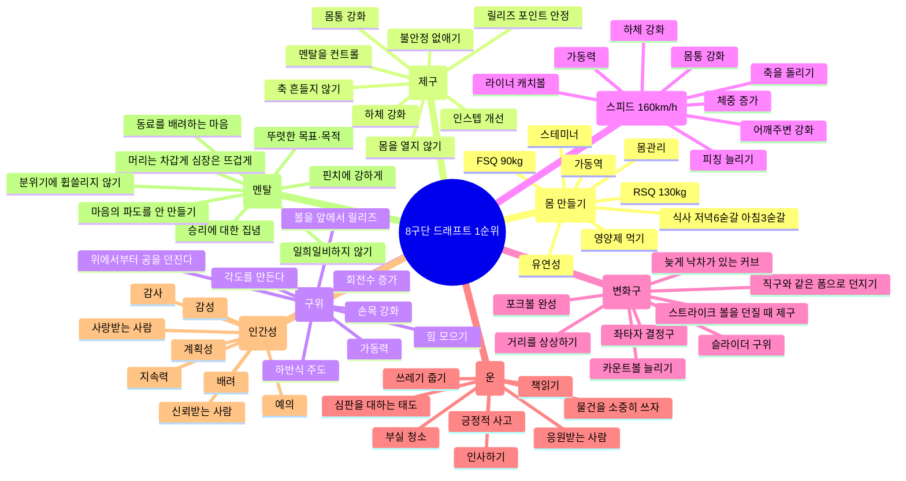
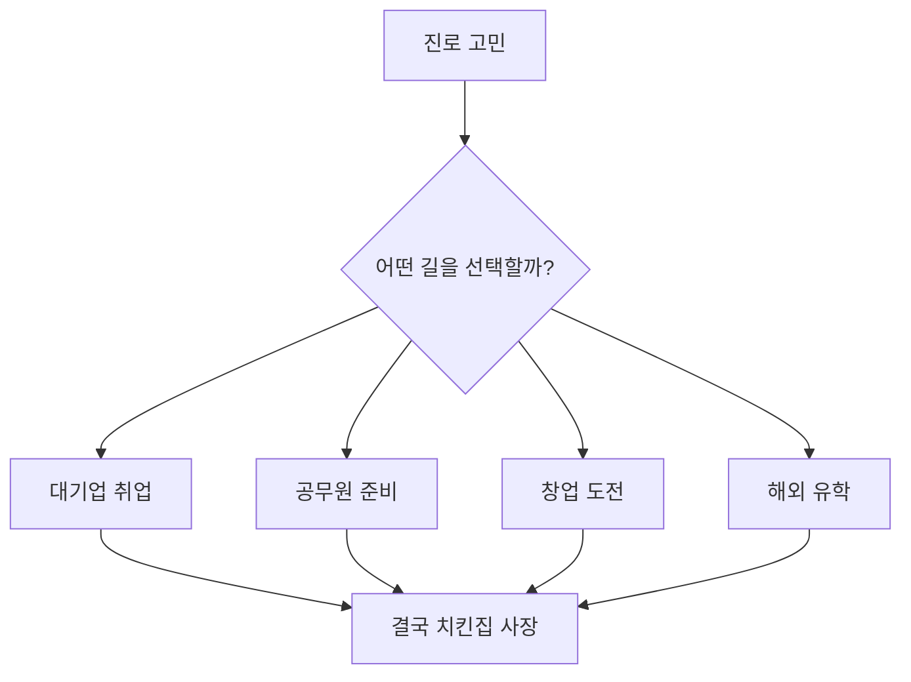
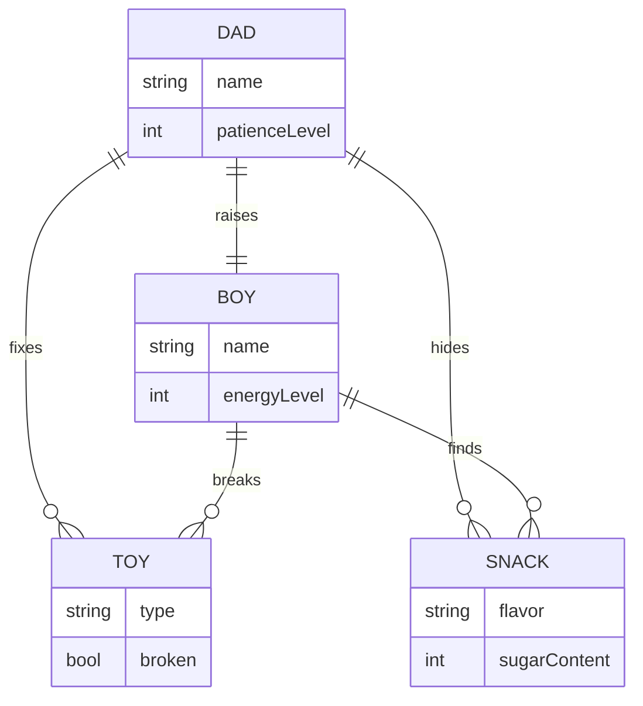

# [My Mermaid Practice](../README.md#my-mermaid--practice)

Technologia~

### **\<References>**

- [https://mermaid-js.github.io/](https://mermaid-js.github.io/)
- [Mermaid Live Editor](https://mermaid.live/)

### **\<List>**

- [Initial Practice (2025.06.25)](#initial-practice-20250625)

## [Initial Practice (2025.06.25)](#list)

- Practice drawing various charts with *Mermaid* : Mindmap, Flowchart, and ERDiagram

### Mindmap : Ohtani's Mandalart

### Flowchart : Doomed to Open a Chicken Shop

### ERDiagram : Dad and Boy

