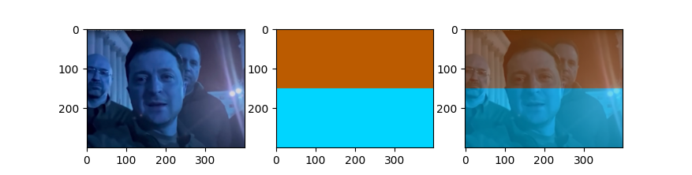
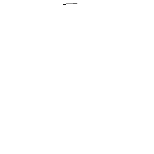
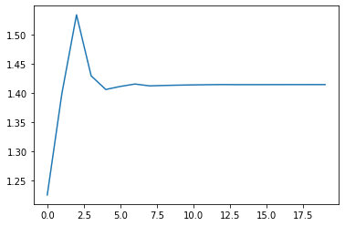
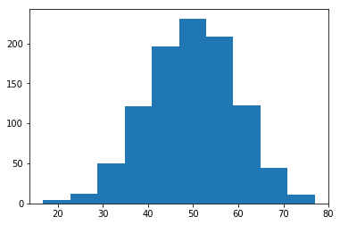
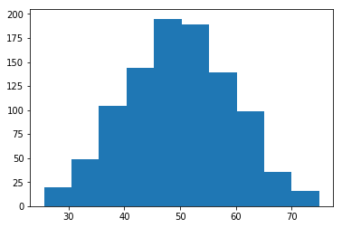
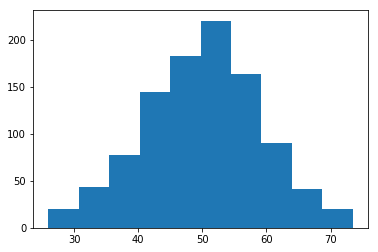
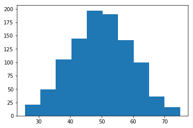
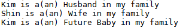

# My Python Practice

I'm sorry `C++` …… I betrayed you.


### \<List>

- [Vertical Alignment 2 (2022.04.27)](#vertical-alignment-2-20220427)
- [Arguements Parsing (2022.03.24)](#arguements-parsing-20220324)
- [Image Blending (2022.02.27)](#image-blending-20220227)
- [Vertical Alignment (2021.12.21)](#vertical-alignment-20211221)
- [Iterator (2021.06.17)](#iterator-20210617)
- [`if` ~ `while` ~ `true` (2021.05.04)](#if--while--true-20210504)
- [`re.split` (2021.04.29)](#resplit-20210429)
- [`__name__ == '__main__'` (2021.04.26)](#__name__--__main__-20210426)
- [Turtle (2021.03.24)](#turtle-20210324)
- [`map()` (2021.02.16)](#map-20210216)
- [Words Mix (2021.01.13)](#words-mix-20210113)
- [Count Words (2020.11.10)](#count-words-20201110)
- [Operator Precedence (2020.06.28)](#operator-precedence-20200628)
- [`print` (2020.03.31)](#print-20200331)
- [Shuffle List (2020.03.30)](#shuffle-list-20200330)
- [Random Seed Influence (2020.01.05)](#random-seed-influence-20200105)
- [Square Root (2020.01.01) (adjusted 2020.01.04)](#square-root-20200101)
- [Fibonacci Series (2019.12.18)](#fibonacci-series-20191218)
- [Generate List (2019.12.07)](#generate-list-20191207)
- [Limited Range Sampling (2019.09.22)](#limited-range-sampling-20190922)
- [`with` ~ `open` (2019.07.21)](#with--open-20190721)
- [Password (2019.05.24)](#password-20190524)
- [Class (2018.02.07)](#class-20180207)
- [`while` (2017.05.15)](#while-20170515)


## [Vertical Alignment 2 (2022.04.27)](#list)

I dreamed of making a new open source library to do it for a while, but `f-string` is too strong …… This devil has broken my dear dream!

```python
sample = [
    ['이렇게', '하면'],
    ['줄이', '잘 맞을까'],
    ['모르겠네', '어디'],
    ['한 번', '볼까'],
]
```

### 1. Normal Approach
```python
# 1. Normal Approach
print("# 1. Normal Approach")
for el in sample :
    print(el[0], el[1])
```
```
# 1. Normal Approach
이렇게 하면
줄이 잘 맞을까
모르겠네 어디
한 번 볼까
```

### 2. Use f-string
```python
# 2. Use f-string
sample[3][0] = '두 번'
print("\n# 2. Use f-string")
for el in sample :
    print(f"{el[0]:<10}", f"{el[1]:<10}")                   # Korean letters drive it to insanity
```
```
# 2. Use f-string
이렇게        하면
줄이         잘 맞을까
모르겠네       어디
두 번        볼까
```

### 2.1 Use f-string : Handle Korean letters
```python
# 2.1 Use f-string : Handle Korean letters
sample[3][0] = '세 번'
print("\n# 2.1 Use f-string 2 : Handle Korean letters")
for r in sample :
    length = [10, 10]
    for c in range(2) :
        for char in r[c] :
            if char >= '가' :
                length[c] -= 1
    # print(length[0], length[1])                           # test : ok
    # print(f"{r[0]:<length[0]} {r[1]:<length[1]}")         # ValueError: Invalid format specifier; length[] → {length[]}
    print(f"{r[0]:<{length[0]}} {r[1]:<{length[1]}}")
```
```
# 2.1 Use f-string 2 : Handle Korean letters
이렇게     하면
줄이       잘 맞을까
모르겠네   어디
세 번      볼까
```

### 2.2 Use f-string : Change alignment direction
```python
sample[3][0] = '네 번'
print("\n2.2 Use f-string : Change alignment direction")
for r in sample :
    length = [10, 10]
    for c in range(2) :
        for char in r[c] :
            if char >= '가' :
                length[c] -= 1
    print(f"{r[0]:>{length[0]}} {r[1]:>{length[1]}}")
```
```
2.2 Use f-string : Change alignment direction
    이렇게       하면
      줄이  잘 맞을까
  모르겠네       어디
     네 번       볼까
```

### 2.3 Use f-string : Code generalization & individual alignment control
```python
sample[3][0] = '다섯 번'
print("\n2.3 Use f-string : Code generalization")
for r in sample :
    length = [10] * len(r)
    for c in range(len(r)) :
        for char in r[c] :
            if char >= '가' :
                length[c] -= 1
        if c == 1 :
            print(f"{r[c]:>{length[c]}}", end = '')
        else :
            print(f"{r[c]:<{length[c]}}", end = '')
    print()
```
```
2.3 Use f-string : Code generalization
이렇게          하면
줄이       잘 맞을까
모르겠네        어디
다섯 번         볼까
```


## [Arguements Parsing (2022.03.24)](#list)
- A practice to parse arguments from command line to `.py` script file
- Reference ☞ https://en.wikipedia.org/wiki/Command-line_argument_parsing

#### ArguementParsing.py
```python
import sys
```
```python
def ArguementParsing() :
    if len(sys.argv) > 1 :                          # not > 0; sys.argv[0] is the script file name
        for arg in sys.argv :
            print(arg)
    else :
        print("No arguments has been received.")
```
```python
# test
def test() :
    for arg in list(sys.argv) :
        print(arg)
```
```python
if __name__ == "__main__" :
    ArguementParsing()
    # test()                                        # 0(path) 1 2 3
```

#### ArguementParsing.bat
```bat
python ArguementParsing.py
python ArguementParsing.py a b c
```

#### Output
```
>python ArguementParsing.py
No arguments has been received.

>python ArguementParsing.py a b c
ArguementParsing.py
a
b
c
```

## [Image Blending (2022.02.27)](#list)
- A practice to blend two images by using `cv2`
- Generate Ukrainian flag with `numpy`
- Reference ☞ https://opencv-python.readthedocs.io/
- **Pray for Ukraine**

#### ImageBlending.py
```py
# 0. Import libraries
import cv2                                                                      # install "opencv-python", but import "cv2"
import numpy as np                                                              # for using np.full()
import matplotlib.pyplot as plt
```
```py
# 1. Call img1
path = "Images/UkrainianPresidentZelenskyy.png"                                 # ★ input your image ★
img1 = cv2.imread(path, cv2.IMREAD_COLOR)
# cv2.imshow("image", img1)                                                     # test : ok
# cv2.waitKey(0)
```

```py
# 2. Call img2 : generate an Ukrainian flag to fit with the img1's size
h, w, c = img1.shape
# print(h, w, c)                                                                # test : ok
h2_1 = int(h/2)                                                                 # h/2 without int() returns float, that occurs error in np.full()
h2_2 = h - h2_1
sapphire = (0xBB, 0x5B, 0x00)                                                   # Ukrainian flag color 1 : not RGB, but BGR
cyberYellow = (0x00, 0xD5, 0xFF)                                                # Ukrainian flag color 2 : not RGB, but BGR
img2_1 = np.full((h2_1, w, 3), sapphire, dtype=np.uint8)                        # not "unit8"!
img2_2 = np.full((h2_2, w, 3), cyberYellow, dtype=np.uint8)
img2 = cv2.vconcat([img2_1, img2_2])
# cv2.imshow("image", img2)                                                     # test : ok
# cv2.waitKey(0)
cv2.imwrite("Images/UkrainianFlag.png", img2)
```

```py
# 3. Blend two images and save it
alpha = 0.5
img3 = cv2.addWeighted(img1, alpha, img2, 1 - alpha, 0)
cv2.imshow("image", img3)
cv2.waitKey(0)
cv2.imwrite("Images/UkrainianFlagBlended.png", img3)
```

```py
# 3.1 Show images on multiple figures
fig = plt.figure()
rows = 1; cols = 3
ax1 = fig.add_subplot(rows, cols, 1)
ax1.imshow(img1)
ax2 = fig.add_subplot(rows, cols, 2)
ax2.imshow(img2)
ax3 = fig.add_subplot(rows, cols, 3)
ax3.imshow(img3)
plt.show()                                                                      # crazy colors
```



## [Vertical Alignment (2021.12.21)](#list)
- A solution for the problem to **align text vertically** with both of English and Korean letters

```python
# Korean letter's length is also measured as 1
abcd = "abcd"
ssjj = "삼성전자"

print(len(abcd))
print(len(ssjj))
```
> 4  
> 4

```python
# How to count Korean letter's length as 2
length = 0
for char in ssjj :
    if char >= '가' :
        length += 2
print(length)
```
> 8

```python
# Vertical alignment
list = ["abcd", "삼성전자"]

# trial 1
for i in list :
    print(i, '\t', 100)
```
> abcd&nbsp;&nbsp;&nbsp;&nbsp;&nbsp;100  
> 삼성전자&nbsp;&nbsp;&nbsp;&nbsp;&nbsp;&nbsp;&nbsp;&nbsp;&nbsp;100

```python
# trial 2
for i in list :
    length = 10
    for char in i :
        if char >= '가' :
            length -= 2
        else :
            length -= 1
    i += length * ' '
    print(i, 100, sep = '')
```
> abcd&nbsp;&nbsp;&nbsp;&nbsp;&nbsp;&nbsp;100  
> 삼성전자&nbsp;&nbsp;100  
> (arranged vertically in the console output)


## [Iterator (2021.06.17)](#list)
- Originally started from a stupid question : Can a `method` call other method in the same class?
- I've just realized it was really obvious (Why does `the constructor` exist?)
- This code is a strange station, that two methods call each other with `iterator`

```python
turn = 0

class Bros :

    def __init__(self) :
        global turn
        turn += 1
        print("<Conversation " + str(turn) + ">")
        self.conversation = iter(["Hey bro", "Wassup"])
        self.n = 0

    def bros1(self) :
        print(self.bros1.__name__ + " : " + next(self.conversation))
        if (self.n < 1) :
            self.n += 1
            self.bros2()
        else :
            print()

    def bros2(self) :
        print(self.bros2.__name__ + " : " + next(self.conversation))
        if (self.n < 1) :
            self.n += 1
            self.bros1()
        else :
            print()
```
```python
if __name__ == "__main__" :

    Bros1 = Bros()
    Bros1.bros1()

    Bros2 = Bros()
    Bros2.bros2()
```

> <Conversation 1>  
> bros1 : Hey bro  
> bros2 : Wassup

> <Conversation 2>  
> bros2 : Hey bro  
> bros1 : Wassup


## [`if` ~ `while` ~ `true` (2021.05.04)](#list)
- A practice of using `if` and `while`
- All the strings and numbers *except* `0` and `False` are regarded as `True`

```python
if True :
    print(True)

if False :
    print(False)

if 'abc' :
    print('abc')

a = 1
if a :
    print(a)

b = 0
if b :
    print(b)

c = -1
if c :
    print(c)
```
> True  
> abc  
> 1  
> -1

```python
while True :
    print(True)
    break

while False :
    print(False)
    break

while '123' :
    print('123')
    break
```
> True  
> 123

## [`re.split` (2021.04.29)](#list)
- Seperating a `string` by plural delimiters
- Using regular expression (`re`)

```Python
txt = 'one two/three.four'

# 1. string.split()
print(txt.split())                  # default : ' '
print(txt.split('/'))
# print(txt.split(' ').split('/'))    # Error

# 2. Regular Expression
import re
print(re.split("[ /.]", txt))       # Enter delimiters directly
print(re.split("\W", txt))          # \W = a-zA-Z0-9
```
> ['one', 'two/three.four']  
> ['one two', 'three.four']  
> ['one', 'two', 'three', 'four']  
> ['one', 'two', 'three', 'four']


## [`\_\_name\_\_ == '\_\_main\_\_'` (2021.04.26)](#list)
- A practice of importing and running `module` in Python
- Using `__name__` and `__main__`

#### ModuleSample.py
```python
if __name__ == '__main__' :
    print("Don't call me yet.")

def call() :
    print("Call me now.")
```
> Don't call me yet.

#### ModuleRun.py
```python
import ModuleSample

ModuleSample.call()
```
> Call me now.


## [Turtle (2021.03.24)](#list)
- A practice of python module `turtle`
- Very easy!



#### Codes
```python
import turtle
import time

turtle.setup(width = 300, height = 300)
turtle.title("My turtle practice")

turtle.hideturtle()         # hide turtle : make the moving speed faster


turtle.home()               # set the position (0, 0)
turtle.position()

turtle.penup()              # penup() = pu() = up() : move without drawing
turtle.setpos(0, 125)

turtle.pendown()            # pendown() = pd() = down() : move with drawing
turtle.right(180)
turtle.circle(125)          # 1st circle

turtle.penup()
turtle.setpos(0, 100)

turtle.pendown()
time.sleep(0.3)
turtle.circle(100)          # 2nd circle

turtle.delay(20)

time.sleep(0.5)
turtle.circle(100, steps=3) # 1st triangle

turtle.penup()
turtle.setpos(0, -100)
turtle.right(180)

turtle.pendown()
turtle.circle(100, steps=3) # 2nd triangle

turtle.penup()
turtle.setpos(0, 100)
turtle.right(180)

turtle.delay(30)

turtle.pendown()
turtle.circle(100, steps=6) # hexagon


turtle.mainloop()           # avoid the screen closing
```

## [`map()` (2021.02.16)](#list)
- To find how `map()` runs
- I guessed the result of running `map()` would be something to contain hidden elements.
- But actually it is a `generator type object`, so has not futural list data before I request by `list()`.
- StackOverflow ☞ https://stackoverflow.com/questions/66225592/
- Additional reference ☞ https://realpython.com/python-map-function/#getting-started-with-pythons-map

#### Codes
```python
def details(txt) :
    print("elements :", txt)
    print("type :", type(txt))
    try :
        print("elements' type :", type(txt[0]), "\n")
    except :
        print("elements' type : an error occurs.\n")

txt = "1 2 3 4 5"
details(txt)

txtsplit = txt.split()
details(txtsplit)

txtmap = map(int, txt.split())
details(txtmap) # an error occurs

txtlist = list(txtmap)
details(txtlist)
```

#### Results
```python
elements : 1 2 3 4 5
type : <class 'str'>
elements' type : <class 'str'>

elements : ['1', '2', '3', '4', '5']
type : <class 'list'>
elements' type : <class 'str'>

elements : <map object at 0x7fefcdfe8dc0>
type : <class 'map'>
elements' type : an error occurs.

elements : [1, 2, 3, 4, 5]
type : <class 'list'>
elements' type : <class 'int'>
```


## [Words Mix (2021.01.13)](#list)
- Read a _csv_ file into a _dictionary_
- Import `csv`
- Seems that _dictionary type_ is not so suitable to generate random paragraphs

#### 0. Check If Words.csv Exists
```python
import os
```
```python
path = "C:\\Users\\……\\Python\\Words.csv"
# \\ : escape character of \
os.path.isfile(path)
```
> True

#### 1. Read Words.csv simply 
```python
import csv
```
```python
with open(path,'r', encoding='utf-8') as f:
    reader = csv.DictReader(f)

    for c in reader:
        for k, v in c.items():
            print(v, end= ' ')
        print("\n")
```
> 멍청하게 떡볶이 먹고 배탈 나는 똥개  
> 어리석게 꼭지에서 주식 사는 너구리  
> 정신 못 차리고 반바지에 긴 양말 신은 코흘리개  
> 한심하게 노래방 가서 고해 부르는 개미햝기  
> 아무 생각없이 담뱃불 붙이다 앞머리 불 붙은 이등병

#### 1-1. Read Words.csv as dictionary type
```python
with open(path,'r', encoding='utf-8') as f:
    reader = csv.DictReader(f)

    for row in reader:
        print(row)
```
> {'\ufeff수식어1': '멍청하게', '수식어2': '떡볶이 먹고 배탈 나는', '명사': '똥개'}  
> {'\ufeff수식어1': '어리석게', '수식어2': '꼭지에서 주식 사는', '명사': '너구리'}  
> {'\ufeff수식어1': '정신 못 차리고', '수식어2': '반바지에 긴 양말 신은', '명사': '코흘리개'}  
> {'\ufeff수식어1': '한심하게', '수식어2': '노래방 가서 고해 부르는', '명사': '개미햝기'}  
> {'\ufeff수식어1': '아무 생각없이', '수식어2': '담뱃불 붙이다 앞머리 불 붙은', '명사': '이등병'}

#### 1-2. Get rid of '\ufeff' from the head of data
```python
with open(path,'r', encoding='utf-8-sig') as f:
    reader = csv.DictReader(f)

    for row in reader:
        print(row)
```
> {'수식어1': '멍청하게', '수식어2': '떡볶이 먹고 배탈 나는', '명사': '똥개'}  
> {'수식어1': '어리석게', '수식어2': '꼭지에서 주식 사는', '명사': '너구리'}  
> {'수식어1': '정신 못 차리고', '수식어2': '반바지에 긴 양말 신은', '명사': '코흘리개'}  
> {'수식어1': '한심하게', '수식어2': '노래방 가서 고해 부르는', '명사': '개미햝기'}  
> {'수식어1': '아무 생각없이', '수식어2': '담뱃불 붙이다 앞머리 불 붙은', '명사': '이등병'}


## [Count Words (2020.11.10)](#list)
- Count words without duplication from .txt file
- import `re` for using `regular expression`

```python
import os
import re
```

```python
# Check if the target file exists
path = "C:\\...\\Python\\subtitle - 1.1.txt"
os.path.isfile(path)
```
> True

```python
# Call words' list with duplication
document_raw = open(path, 'r')
document_lower = document_raw.read().lower()
words_duplication = re.findall(r'\b[a-z]{3,15}\b', document_lower)
# Regular expression to avoid meaningless or wrong words
```

```python
# Remove duplication from the list
words = set(words_duplication)
print(len(words))
```
> 455


## [Operator Precedence (2020.06.28)](#list)
answer for my friend YW Jang's question

```python
print("F" == "M")
```
> False

```python
print(bool("m"))
```
> True

`==` runs prior to `or` in Python

```python
print("F" == "M" or "m")
print(("F" == "M") or "m") # the same with the above line
```
> True

☞ reference : https://www.programiz.com/python-programming/precedence-associativity


## [`print` (2020.03.31)](#list)
simple practice with `print()`

```python
#1. Print normally
print("위")
print("아래")
```
> 위  
> 아래

```python
#2. Write on the same line
print("왼쪽", end='')
print("에 붙여서 계속")
```
> 왼쪽에 붙여서 계속

```python
#3. Change lines within one function
print("줄을\n막\n바꿔")
```
> 줄을  
> 막  
> 바꿔


## [Shuffle List (2020.03.30)](#list)
- find how to get random lists without overlapping values
- use `random` `random.randint` `random.sample`

```python
import random
```

#### Trial 1 : Use `random.randint()`
```python
shufflelist1 = []

for i in range(0,20) :
    random.seed(330 + i)
    shufflelist1.append(random.randint(1, 20))

print(shufflelist1) # There are overlapping values.
```
> [20, 11, 8, 18, 8, 5, 1, 7, 4, 5, 13, 19, 4, 7, 13, 10, 18, 12, 11, 14]

#### Trial 2 : Use `random.sample()`
```python
random.seed(330)
shufflelist2 = random.sample(range(1, 21), 20)

print(shufflelist2) # random.sample() offers values without overlapping.
```
> [20, 3, 2, 13, 1, 6, 10, 9, 15, 11, 14, 4, 18, 8, 16, 17, 7, 19, 12, 5]

#### Trial 3 : Use `while` Statement
```python
shufflelist3 = []
loopnum = 0

while len(shufflelist3) < 20 :
    random.seed(330 + loopnum)
    r = random.randint(1,20)
    if r not in shufflelist3 : shufflelist3.append(r)
    loopnum += 1

print(shufflelist3)
# It seems similar with Trial 1's sequence but there's no overlapping values.
```
> [20, 11, 8, 18, 5, 1, 7, 4, 13, 19, 10, 12, 14, 6, 2, 3, 17, 16, 15, 9]  
```python
print(loopnum) # It shows how many times overlapping numbers are rejected.
```
> 87


## [Random Seed Influence (2020.01.05)](#list)
make sure the range of `random.seed()`'s influence  
☞ `random.seed()` affects just one time!

```python
import random
```

```python
# case 1
print(random.random())
print(random.random())
print(random.random())
```
> 0.48515227527760874  
> 0.48808537244754757  
> 0.9509662749522355

```python
# case 2
random.seed(105)
print(random.random())
print(random.random())
print(random.random())
```
> **0.8780993490764925**  
> 0.3491186468357038  
> 0.7907236599059974

```python
# case 2-1
random.seed(105); print(random.random())
random.seed(105); print(random.random())
random.seed(105); print(random.random())
```
> **0.8780993490764925**  
> **0.8780993490764925**  
> **0.8780993490764925**

```python
# case 3
random.seed(105)
for i in range(0,3) :
    print(random.random())
```
> **0.8780993490764925**  
> 0.3491186468357038  
> 0.7907236599059974

```python
# case 3-1
for i in range(0,3) :
    random.seed(105); print(random.random())
```
> **0.8780993490764925**  
> **0.8780993490764925**  
> **0.8780993490764925**


## [Square Root (2020.01.01)](#list)
an algorithm to find n's square root without `math.sqrt()`  
- adjusted 2020.01.04 : rearrange methods' order in `for` Loop for improving intuitive understanding

```python
import random
import math
import matplotlib.pyplot as plt

n = 2 # should be larger than 1
k = 20 # run loop k times

squareroot = []
lowerlimit, upperlimit = 1, n

for i in range(k) :

    random.seed(20200104) # can be removed
    squareroot.append(random.uniform(lowerlimit, upperlimit))
    square = squareroot[i] ** 2
    print(i+1, squareroot[i], square, square-n)

    if square == n :
        break;
    elif square < n :
        # print("smaller")
        lowerlimit = max(squareroot[i], lowerlimit)
    else :
        # print("larger")
        upperlimit = min(squareroot[i], upperlimit)

myplot = plt.plot(range(k), squareroot)
# myplot.hlines(math.sqrt(n), color="red", linestyle="--") # doesn't work
```
> 1 1.224709461308563 1.4999132646187106 -0.5000867353812894  
> 2 1.3989245806155413 1.956989982250368 -0.04301001774963198  
> 3 1.5339919143112415 2.3531311931722674 0.3531311931722674  
> (중략)  
> 19 1.4141854421168503 1.9999204646952313 -7.953530476867421e-05  
> 20 1.4141980335178153 1.9999560780056558 -4.3921994344220394e-05 



```python
# practice
random.random()
random.randrange(1,n) # output only integer
random.uniform(1,n) # output float
list(range(10))
```
> 0.2508550895840985  
> 1  
> 1.2710268293926659  
> [0, 1, 2, 3, 4, 5, 6, 7, 8, 9]  


## [Fibonacci Series (2019.12.18)](#list)
Simply Generating `Fibonacci Series` by Python

```python
a = [1, 1]
n = 2

while n<10 : # length = 10
    a.append(a[n-2] + a[n-1])
    n += 1

print(a)
```
> [1, 1, 2, 3, 5, 8, 13, 21, 34, 55]  


## [Generate List (2019.12.07)](#list)
generate lists by various ways

```python
list1 = [[0,0], [0,0], [0,0], [0,0]]
list2 = [[0,0]] * 4
list3 = [0,0] * 4

print(list1, "\n", list2, "\n", list3)
list1 == list2
```

> [[0, 0], [0, 0], [0, 0], [0, 0]]  
> [[0, 0], [0, 0], [0, 0], [0, 0]]  
> [0, 0, 0, 0, 0, 0, 0, 0]  
> True  


## [Limited Range Sampling (2019.09.22)](#list)
- Generate normal distributed sample with limited range
- Use `numpy` `matplotlib.pyplot` `scipy`

#### Generate a normal distribution with limited range [25, 75]
```python
import numpy as np
import matplotlib.pyplot as plt
from scipy import stats

mu, sigma, n = 50, 10, 1000
llimit, rlimit = 25, 75

data = np.random.normal(mu, sigma, n)
```

#### Method 0. Generating initial data (not trimmed yet)
```python
plt.hist(data)
stats.describe(data)[0:2] # [0] : nobs, [1] : minmax
```

> (1000, (16.763171096395133, 76.969552776105601))

#### Method 1. Trim with rack of amount
```python
data1 = data[(data >= llimit) & (data <= rlimit)]
```
```python
plt.hist(data1)
stats.describe(data1)[0:2]
```

> (991, (25.600374595125377, 74.942171158969671))

#### Method 2. Check each one trial
```python
data2, amount = [], 0

while amount < n :
    data_temp = np.random.normal(mu, sigma, 1)
    if (data_temp >= llimit) & (data_temp <= rlimit) :
        data2 = np.append(data2, data_temp)
        amount += 1
```
```python
plt.hist(data2)
stats.describe(data2)[0:2]
```

> (1000, (25.987274047611137, 73.473315070409228))

#### Method 3. Generate one round and fill the lack
```python
data3 = data[(data >= llimit) & (data <= rlimit)]
amount = len(data3)

while amount < n :
    data_temp = np.random.normal(mu, sigma, 1)
    if (data_temp >= llimit) & (data_temp <= rlimit) :
        data3 = np.append(data3, data_temp)
        amount += 1
```
```python
plt.hist(data3)
stats.describe(data3)[0:2]
```

> (1000, (25.600374595125377, 74.942171158969671))


## [`with` ~ `open` (2019.07.21)](#list)
- read binary file
- convert decimal number ↔ hexadecimal number

```python
# get current working directory
import os

os.getcwd()
print(os.getcwd())

# check if the file exists
os.path.isfile("path")
```
> True

```python
import binascii

# with statement
with open('path','rb') as f: # rb : read & binary
    string = f.read()
    print(string[0:10])
    print(binascii.b2a_hex(string[0:10]))
```
> b'1990.02.19'  
> b'313939302e30322e3139'

```python
# with statement X
f = open('path','rb')
data = f.read()
print(data[0:10])
print(binascii.b2a_hex(data[0:10]))
f.close()
```
> b'1990.02.19'  
> b'313939302e30322e3139'

```python
# decimal → hexadecimal
hex(30000)
hex(3000000)
hex(100)
```
> '0x7530'  
> '0x2dc6c0'  
> '0x64'

```python
# hexadecimal → decimal
int('7530', 16)
int('2dc6c0', 16)
int('64', 16)
```
> 30000  
> 3000000  
> 100


## [Password (2019.05.24)](#list)
input the correct passworld within 5 trials or die  
practice if~else, break/continue, time.sleep() and so on

```python
import time # for using time.sleep()

chance = 0
pw_original = "mymy" # password. a word that calls a pass. you nahm sayin?

while chance < 5 :
    pw_input = input("Input your password : ")

    # right
    if pw_original == pw_input :
        print("You entered the correct password")
        break
    
    # wrong
    else:
        chance += 1
        print("You entered the wrong passwords", chance, "times.")
        if chance == 5 :
            print("You bad guys will be delayed as a penalty.")
            time.sleep(3)
        else :
            continue

# Of course, saving the original password in this file is somewhat stupid.
# But, yes I am.
```


## [Class (2018.02.07)](#list)
a simple Python `class` practice

```python
class MyFirstClass :
    
    def Family(self, name, role):
        print(name, "is a(an)", role, "in my family")

Do = MyFirstClass()

Do.Family("Kim", "Husband")
Do.Family("Shin", "Wife")
Do.Family("Kim", "Future Baby")
```



I found that a simple `class` in Python doesn't need stuffs like `__main__`, `__init__` and so on.
What the `__hell__`?


## [`while` (2017.05.15)](#list)
a simple Python practice

```python
death_entropy = 100
my_entropy = 1

while(my_entropy < death_entropy) :
    print(my_entropy)
    my_entropy += 1
print('Nirvana')
```