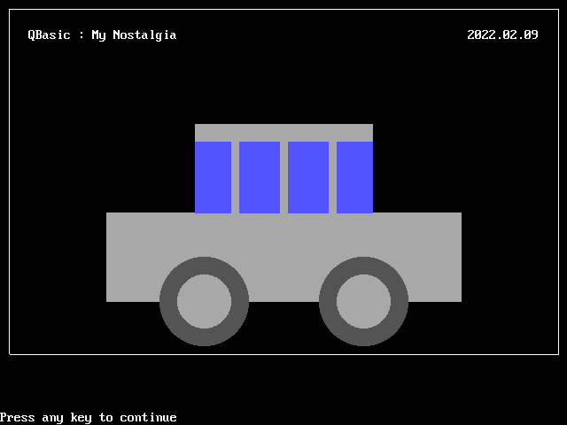

# My QBasic Practice

Nostalgia!


### \<List>

- [Draw A Car (2022.02.09)](#draw-a-car-20220209)
- [Play Music (2021.02.20)](#play-music-20210220)
- [Hello World (2020.02.27)](#hello-world-20200227)


## [Draw A Car (2022.02.09)](#list)

- Remember how I felt when I was a primary school student



#### DrawCar.bas
```bas
CLS

SCREEN 12       '640 x 480 / 16 colors
wid% = 640      'Can I get these parameters automatically?
hei% = 480

'Border
LINE (10, 10)-(wid% - 10, 10), 15, B
LINE (10, hei% - 80)-(wid% - 10, hei% - 80), 15, B
LINE (10, 10)-(10, hei% - 80), 15, B
LINE (wid% - 10, 10)-(wid% - 10, hei% - 80), 15, B

'Memo
LOCATE 3, 5
PRINT "QBasic : My Nostalgia"
LOCATE 3, 67
PRINT "2022.02.09"

'Body
LINE (wid% / 2 - 100, hei% / 2 - 100)-(wid% / 2 + 100, hei% / 2), 7, BF
LINE (wid% / 2 - 200, hei% / 2)-(wid% / 2 + 200, hei% / 2 + 100), 7, BF

'Windows
LINE (wid% / 2 - 100, hei% / 2 - 80)-(wid% / 2 - 60, hei% / 2), 9, BF
LINE (wid% / 2 - 50, hei% / 2 - 80)-(wid% / 2 - 5, hei% / 2), 9, BF
LINE (wid% / 2 + 5, hei% / 2 - 80)-(wid% / 2 + 50, hei% / 2), 9, BF
LINE (wid% / 2 + 60, hei% / 2 - 80)-(wid% / 2 + 100, hei% / 2), 9, BF

'Wheels
CIRCLE (wid% / 2 - 90, hei% / 2 + 100), 50, 8
CIRCLE (wid% / 2 + 90, hei% / 2 + 100), 50, 8
PAINT (wid% / 2 - 120, hei% / 2 + 100), 8, 8
PAINT (wid% / 2 + 120, hei% / 2 + 100), 8, 8
CIRCLE (wid% / 2 - 90, hei% / 2 + 100), 30, 7
CIRCLE (wid% / 2 + 90, hei% / 2 + 100), 30, 7
PAINT (wid% / 2 - 90, hei% / 2 + 100), 7, 7
PAINT (wid% / 2 + 90, hei% / 2 + 100), 7, 7

END
```


## [Play Music (2021.02.20)](#list)

- Practice of functions : `BEEP` `SOUND` `PLAY`
- Run by `MS QBasic 4.5`

#### Xerxes.bas
Using `SHELL` function to borrow the `CLS` command from DOS
```Bas
 SHELL "CLS"
 PRINT "I am generous"
```
> I am generous

#### Sound.bas
Refer to ☞ https://en.wikibooks.org/wiki/QBasic/Sound
```Bas
SHELL "CLS"

'BEEP
PRINT "BEEP"
BEEP
PRINT CHR$(7)
SLEEP

'SOUND
PRINT "SOUND" + CHR$(13) 'CHR$(13) : Line break
FOR i% = 1 TO 30
        SOUND i% * 100, 1  'Frequency, Duration
NEXT
SLEEP

'PLAY
PRINT "PLAY" + CHR$(13)
PLAY "L16 CDEFGAB>C" '> : Move up one octave
SLEEP
```
**Results** : [BEEP](./Sounds/QB_SOUND_BEEP.wav) [SOUND](./Sounds/QB_SOUND_SOUND.wav) [PLAY](./Sounds/QB_SOUND_PLAY.wav)  
(* These can't be played directly, but played after downloading.)

#### SchoolBell.bas
Play the same song with the keys of both C major and C minor
```Bas
SHELL "CLS"

PRINT "School Bell"

PRINT "C major"
PLAY "MS G8G8A8A8 G8G8E4 G8G8E8E8 D6 P8"
PLAY "MS G8G8A8A8 G8G8E4 G8E8D8E8 C6 P8"

PRINT "C minor"
PLAY "MS G8G8A-8A-8 G8G8E-4 G8G8E-8E-8 D6 P8"
PLAY "MS G8G8A-8A-8 G8G8E-4 G8E-8D8E-8 C6 P8"
```
**Results** : [C major](./Sounds/QB_PLAY_C%20major.wav) [C minor](./Sounds/QB_PLAY_C%20minor.wav)  
(* These can't be played directly, but played after downloading.)


## [Hello World (2020.02.27)](](#list))

#### HelloWorld.bas

```Bas
print "Hello World!"
```
> Call to undefined sub 'print'

```Bas
print("Hello World!")
```
> Call to undefined sub 'print'

```Bas
print 'Hello World!'
```
> Call to undefined sub 'print'

How can I make `print` work?

```Bas
PRINT "Hello World!"
```
> Hello World!

The secret was UPPER CASE!

```Bas
PRINT 'Hello World!'
```
>
`''` seems to be used for single-line comments.

```Bas
'You can't see what I'm saying.'
```
ㅋ