# [My R Practice](../README.md#my-r-practice)

The true analysts use R, different from computer geeks using Python!


### List

- [`any()` & `all()` Practice (2024.02.19)](#any--all-practice-20240219)
- [Slicing String with `substr()` (2023.06.26)](#slicing-string-with-substr-20230626)
- [`List` Practice in R (2022.11.22)](#list-in-r-20221122)
- [`Shiny` - 1st Trial (2022.05.04)](#shiny---1st-trial-20220504)
- [Scatter Points in a Circle (2021.08.16)](#scatter-points-in-a-circle-20210816)
- [Permutations and Combinations (2021.04.05)](#permutations-and-combinations-20210405)
- [Generating Array and Variables by for Loop (2019.12.06)](#generating-array-and-variables-by-for-loop-20191206)
- [Fibonacci Tornado (2017.05.07)](#fibonacci-tornado-20170507)


## [`any()` & `all()` Practice (2024.02.19)](#list)

- Practice to use `any()` `all()` and `duplicated()` in R
  - An in-depth study from [Lottery Number Generator (2024.02.15)](https://github.com/kimpro82/MyBizApps/blob/main/R/Lotto/README.md#lottery-number-generator-20240215)
- References
  - [RDocumentation](https://www.rdocumentation.org/) > [any: Are Some Values True?](https://www.rdocumentation.org/packages/base/versions/3.6.2/topics/any)
  - [Statistics Globe](https://statisticsglobe.com/) > [The all & any R Functions | 4 Example Codes](https://statisticsglobe.com/all-any-r-function/)

  #### `AnyAll.r`

  <details open="">
    <summary>0. Declare a vector</summary>

  ```r
  vec <- c(1:10)
  ```
  </details>
  <details>
    <summary>1. Understanding the error</summary>

  ```r
  # - code          : length(nums) == 6 && !(luckyNum %in% nums)
  # - error message : 'length = 6' in coercion to 'logical(1)'
  length(vec)                             # Output the length of the vector
  length(vec) == 10                       # Check if the length is equal to 10
  3 %in% vec                              # Check if 3 is present in the vector
  !(3 %in% vec)                           # Check if 3 is not present in the vector
  length(vec) == 10 && !(3 %in% vec)      # Combine length check and presence check
  # Explanation:
  #   The error occurred because `luckyNum` was a vector, not a scalar value.
  ```
  ```r
  [1] 10
  [1] TRUE
  [1] TRUE
  [1] FALSE
  [1] FALSE
  ```
  </details>
  <details open="">
    <summary>2. any() & all()</summary>

  ```r
  vec > 5                                 # Check which elements are greater than 5
  any(vec > 5)                            # Check if any element is greater than 5
  all(vec > 5)                            # Check if all elements are greater than 5
  ```
  ```r
  [1] FALSE FALSE FALSE FALSE FALSE  TRUE  TRUE  TRUE  TRUE  TRUE
  [1] TRUE
  [1] FALSE
  ```
  </details>
  <details>
    <summary>3. duplicated() with any() & all()</summary>

  ```r
  vec2 <- c(vec, 9:12)
  duplicated(vec2)                        # Check for duplicated elements in the vector
  any(duplicated(vec2))                   # Check if any element is duplicated
  all(duplicated(vec2))                   # Check if all elements are duplicated
  ```
  ```r
  [1] FALSE FALSE FALSE FALSE FALSE FALSE FALSE FALSE FALSE FALSE  TRUE  TRUE FALSE FALSE
  [1] TRUE
  [1] FALSE
  ```
  </details>


## [Slicing String with `substr()` (2023.06.26)](#list)

- Dealing with strings in R is a hidden trap

  #### `Substr.r`

  ```r
  str <- "R도 명색이 프로그래밍 언어인데, 문자열 슬라이싱이 안 될 리가 없잖아. 근데 왜 안 돼? 왜 나 괴롭혀?"
  ```

  <details>
    <summary>Trial 1 : Do like other general languages</summary>

  ```r
  str[1:3]
  # The entire string is considered as the 1st element of a vector.
  # The 2nd and 3rd elements of the vector are regarded as empty.
  ```
  ```txt
  [1] "R도 명색이 프로그래밍 언어인데, 문자열 슬라이싱이 안 될 리가 없잖아. 근데 왜 안 돼? 왜 나 괴롭혀?"
  [2] NA
  [3] NA
  ```
  </details>
  <details open="">
    <summary>Trial 2 : Use substr()</summary>

  ```r
  substr(str, 1, 19)
  substr(str, 20, 41)
  substr(str, 42, 100)
  ```
  ```txt
  [1] "R도 명색이 프로그래밍 언어인데, "
  [1] "문자열 슬라이싱이 안 될 리가 없잖아. "
  [1] "근데 왜 안 돼? 왜 나 괴롭혀?"
  ```
  </details>
  <details>
    <summary>Trial 2-1 : For loop with substr()</summary>

  ```r
  for (i in 1:nchar(str)) {                                                       # not length()
      cat(substr(str, i, i), seq = " ")
  }
  ```
  ```txt
  R  도     명  색  이     프  로  그  래  밍     언  어  인  데  ,     문  자  열     슬  라  이  싱  이     안     될     리  가     없  잖  아  .     근  데     왜     안     돼  ?     왜     나     괴  롭  혀  ?
  ```
  </details>
  <details>
    <summary>Trial 3 : Use strsplit()</summary>

  ```r
  strsplit1 <- strsplit(str, split = "[,] |[.] ", fixed = FALSE)
  strsplit2 <- strsplit(str, split = "[,.] ", fixed = FALSE)
  strsplit1
  strsplit2

  strsplit2[1]
  strsplit2[[1]]
  strsplit2[[1]][1]

  cat(strsplit2[[1]])
  cat(strsplit2[[1]][1])
  ```
  ```txt
  [[1]]
  [1] "R도 명색이 프로그래밍 언어인데"      "문자열 슬라이싱이 안 될 리가 없잖아" "근데 왜 안 돼? 왜 나 괴롭혀?"

  [[1]]
  [1] "R도 명색이 프로그래밍 언어인데"      "문자열 슬라이싱이 안 될 리가 없잖아" "근데 왜 안 돼? 왜 나 괴롭혀?"
  ```
  ```txt
  [[1]]
  [1] "R도 명색이 프로그래밍 언어인데"      "문자열 슬라이싱이 안 될 리가 없잖아" "근데 왜 안 돼? 왜 나 괴롭혀?"

  [1] "R도 명색이 프로그래밍 언어인데"      "문자열 슬라이싱이 안 될 리가 없잖아" "근데 왜 안 돼? 왜 나 괴롭혀?"

  [1] "R도 명색이 프로그래밍 언어인데"
  ```
  ```txt
  R도 명색이 프로그래밍 언어인데 문자열 슬라이싱이 안 될 리가 없잖아 근데 왜 안 돼? 왜 나 괴롭혀?

  R도 명색이 프로그래밍 언어인데
  ```
  </details>


## [`List` Practice in R (2022.11.22)](#list)

- It's not the linked list that we used to know, but the data strurture that consists of key & value!

  #### `List.r`

  <details>
    <summary>0. Set a sample data</summary>

  ```R
  Chuhan <- list(
      "ruler" = "Liu Bei",
      "general" = c("Guan Yu", "Zhang Fei"),
      "advisor" = "Zhuge Liang"
  )
  Chuhan
  ```

  ```
  $ruler
  [1] "Liu Bei"

  $general
  [1] "Guan Yu"   "Zhang Fei"

  $advisor
  [1] "Zhuge Liang"
  ```
  </details>

  <details>
    <summary>1. Read by key</summary>

  ```R
  Chuhan["ruler"]
  Chuhan[1]                                       # the same with Chuhan["ruler"]
  Chuhan[[1]]

  Chuhan[2]
  Chuhan[2][1]
  Chuhan[[2]][1]

  print(Chuhan[[2]][1])
  cat(Chuhan[[2]][1])
  ```

  ```
  $ruler
  [1] "Liu Bei"

  $ruler
  [1] "Liu Bei"

  [1] "Liu Bei"

  $general
  [1] "Guan Yu"   "Zhang Fei"

  $general
  [1] "Guan Yu"   "Zhang Fei"

  [1] "Guan Yu"

  [1] "Guan Yu"

  Guan Yu
  ```
  </details>

  <details>
    <summary>2. Read by value</summary>

  ```R
  match("Zhuge Liang", Chuhan)                    # get the index of the value
  Chuhan[match("Zhuge Liang", Chuhan)]            # the key & value from the index
  names(Chuhan[match("Zhuge Liang", Chuhan)])     # read only the key
  ```

  ```
  [1] 3

  $advisor
  [1] "Zhuge Liang"

  [1] "advisor"
  ```
  </details>


## [`Shiny` - 1st Trial (2022.05.04)](#list)

- Hello Shiny
- Reference ☞ https://shiny.rstudio.com/tutorial/written-tutorial/lesson1/

  ```r
  if (!requireNamespace("shiny")) install.packages("shiny")
  library("shiny")

  runExample("01_hello")
  ```

  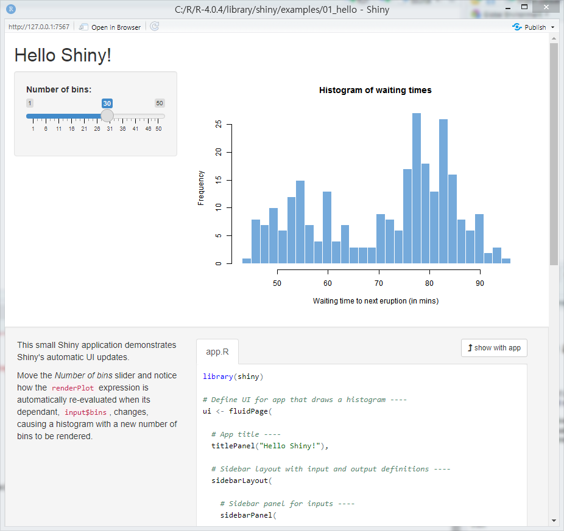


## [Scatter Points in a Circle (2021.08.16)](#list)

- Scatter points in a circle in various ways  
- Use `plotrix`

  <details>
    <summary>0. Call "plotrix" library (install if not exist)</summary>

  ```R
  if(!requireNamespace("plotrix")) install.packages("plotrix")
  library("plotrix")
  ```
  </details>

  <details>
    <summary>1. Monte Carlo method 1</summary>

  ```R
  r     = 10
  n     = 30000
  ```
  ```R
  rr    = runif(n, 0, r)                    # rr    : randomly sampled radius
  rrad  = runif(n, 0, 2 * pi)               # rrad  : randomly sampled radian

  x     = rr * cos(rrad)                    # yes, I am a math genius!
  y     = rr * sin(rrad)
  ```
  ```R
  windows(width = 7, height = 7)
  plot(x, y, pch = '.', col = "red",
    main = "1. Monte Carlo method 1")
  abline(v = -round(r*1.3):round(r*1.3), h = -r:r, col = "gray")
  draw.circle(0, 0, r)                      # not exact drawing, crazy
  ```

  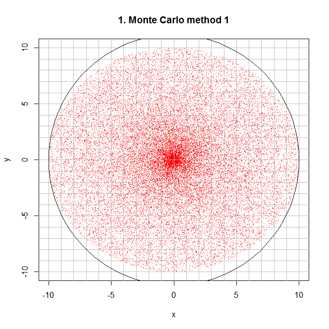
  </details>

  <details>
    <summary>1.1 Fit the circle on the coordinates</summary>

  ```R
  windows(width = 7, height = 7)
  plot(x, y, pch = '.', col = "red", asp = 1, # modify asp(aspect ratio) option as 1
    main = "1.1 Monte Carlo method (with modified asp ratio)")
  abline(v = -round(r*1.3):round(r*1.3), h = -r:r, col = "gray")
  draw.circle(0, 0, r)
  ```

  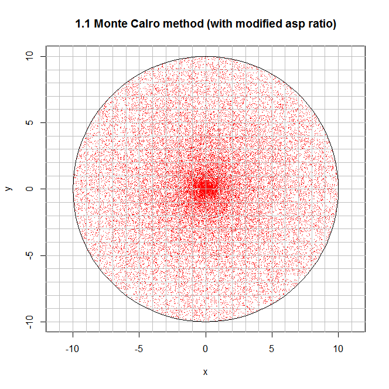
  </details>

  <details>
    <summary>2. Monte Carlo method 2 (disperse the crowded central population)</summary>

  ```R
  x   = c(); y = c()
  cnt = 0
  ```
  ```R
  while (cnt < n)                           # insert points only in the circle
  {
    temp = runif(2, -r, r)
    if (temp[1]^2 + temp[2]^2 < r^2)
    {
      x   = c(x, temp[1])
      y   = c(y, temp[2])
      cnt = cnt + 1                         # I miss ++ operator ……
    }
  }
  ```
  ```R
  windows(width = 7, height = 7)
  plot(x, y, pch = '.', col = "red", asp = 1,
    main = "2. Monte Carlo method 2 (disperse the crowded central pop.)")
  abline(v = -round(r*1.3):round(r*1.3), h = -r:r, col = "gray")
  draw.circle(0, 0, r)
  ```
  </details>
  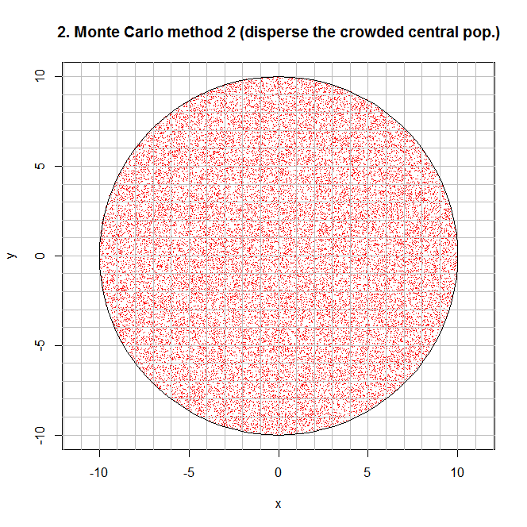

  <details>
    <summary>3. Points with lattice spacing</summary>

  ```R
  x         = c(); y = c()
  area      = pi * r^2
  interval  = sqrt(area / n)
  num       = as.integer(floor(2 * r / interval))
  temp      = c(-r, -r)
  ```
  ```R
  for (i in 1:num)
  {
    temp[1] = temp[1] + interval

    for (j in 1:num)
    {
      temp[2] = temp[2] + interval

      if (temp[1]^2 + temp[2]^2 < r^2)
      {
        x = c(x, temp[1])
        y = c(y, temp[2])
      }
    }

    temp[2] = -r
  }
  ```
  ```R
  length(x); length(y)
  ```
  > [1] 29988  
  > [1] 29988
  ```R
  windows(width = 7, height = 7)
  plot(x, y, pch = '.', col = "red", asp = 1,
    main = "3. Points with lattice spacing")
  abline(v = -round(r*1.3):round(r*1.3), h = -r:r, col = "gray")
  draw.circle(0, 0, r)
  ```

  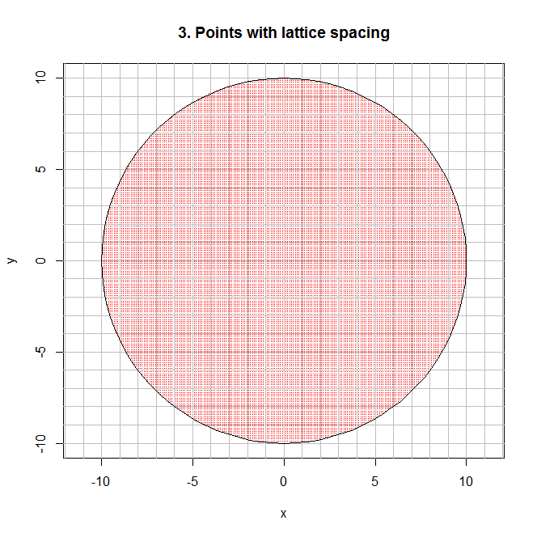
  </details>

  <details>
    <summary>3.1 Points with lattice spacing including outside the circle</summary>

  ```R
  x     = c(); y = c(); xyCol = c()
  temp  = c(-r, -r)
  ```
  ```R
  for (i in 1:num)
  {
    temp[1] = temp[1] + interval
    
    for (j in 1:num)
    {
      temp[2] = temp[2] + interval

      x = c(x, temp[1])
      y = c(y, temp[2])

      if (temp[1]^2 + temp[2]^2 < r^2) xyCol = c(xyCol,"red")
      else xyCol = c(xyCol,"blue")
    }

    temp[2] = -r
  }
  ```
  ```R
  length(x); length(y)
  ```
  > [1] 38025  
  > [1] 38025
  ```R
  length(xyCol); length(xyCol[xyCol=="red"]); length(xyCol[xyCol=="blue"])
  ```
  > [1] 38025  
  > [1] 29988  
  > [1] 8037
  ```R
  windows(width = 7, height = 7)
  plot(x, y, pch = '.', col = xyCol, asp = 1,
    main = "3.1 Points with lattice spacing 2")
  abline(v = -round(r*1.3):round(r*1.3), h = -r:r, col = "gray")
  draw.circle(0, 0, r)
  ```
  </details>

  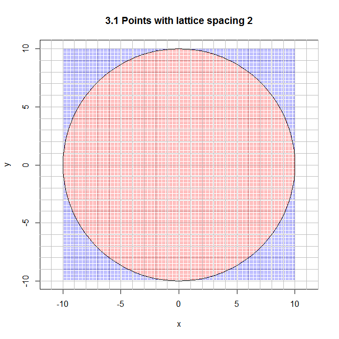


## [Permutations and Combinations (2021.04.05)](#list)

- get permutations and combinations  
- using `gtools`

  <details>
    <summary>Factorial</summary>

  ```R
  factorial(4)    # 4! = 4 * 3 * 2 * 1
  ```
  > [1] 24
  </details>

  <details>
    <summary>Permutation</summary>

  ```R
  # loading gtools library
  if (!requireNamespace("gtools")) {
      install.packages('gtools')
  }
  library(gtools)                             # for using permutations() and combinations()
  ```
  ```R
  # ?permutations
  # permutations(n, r, v=1:n, set=TRUE, repeats.allowed=FALSE)
  # n                 Size of the source vector
  # r                 Size of the target vectors
  # v                 Source vector. Defaults to 1:n
  # set               Logical flag indicating whether duplicates should be removed from the source vector v. Defaults to TRUE.
  # repeats.allowed   Logical flag indicating whether the constructed vectors may include duplicated values. Defaults to FALSE.
  ```
  ```R
  balls <- c("Red", "Yellow", "Blue")
  ```
  ```R
  permutations(3, 2, v = balls, repeats.allowed = TRUE)  # 3Π2
  ```
  > [1,] "Blue"   "Blue"  
  > [2,] "Blue"   "Red"  
  > [3,] "Blue"   "Yellow"  
  > [4,] "Red"    "Blue"  
  > [5,] "Red"    "Red"  
  > [6,] "Red"    "Yellow"  
  > [7,] "Yellow" "Blue"  
  > [8,] "Yellow" "Red"  
  > [9,] "Yellow" "Yellow"
  ```R
  permutations(3, 2, v = balls, repeats.allowed = FALSE) # 3P2
  permutations(3, 2, v = balls)
  ```
  > [1,] "Blue"   "Red"  
  > [2,] "Blue"   "Yellow"  
  > [3,] "Red"    "Blue"  
  > [4,] "Red"    "Yellow"  
  > [5,] "Yellow" "Blue"  
  > [6,] "Yellow" "Red"
  </details>

  <details>
    <summary>Combination</summary>

  ```R
  combn(balls, 2)
  ```
  > [1,] "Red"    "Red"  "Yellow"  
  > [2,] "Yellow" "Blue" "Blue"
  ```R
  combinations(3, 2, v = balls, repeats.allowed = TRUE)  # 3H2
  ```
  > [1,] "Blue"   "Blue"  
  > [2,] "Blue"   "Red"  
  > [3,] "Blue"   "Yellow"  
  > [4,] "Red"    "Red"  
  > [5,] "Red"    "Yellow"  
  > [6,] "Yellow" "Yellow"
  ```R
  combinations(3, 2, v = balls, repeats.allowed = FALSE) # 3C2
  ```
  > [1,] "Blue" "Red"  
  > [2,] "Blue" "Yellow"  
  > [3,] "Red"  "Yellow"
  </details>

  <details>
    <summary>Number of cases</summary>

  ```R
  prod(4, 2)                                  # 4P2
  choose(4, 2)                                # 4C2
  ```
  > [1] 8  
  > [1] 6
  </details>


## [Generating Array and Variables by for Loop (2019.12.06)](#list)

- answer for a question at chatting room  
  - R array-related data structure is actually defined as vector, matrix and array about each dimension's array.  
  - I call it just 'array' by common mathematical notion here, but it is different from R's strict data structure definition.  

  <details>
    <summary>1. generating array by for loop</summary>

  ```R
  mylist = c()

  for (i in 1:10) {
    mylist[i] = i
  }

  mylist
  ```
  >  [1]  1  2  3  4  5  6  7  8  9 10
  </details>

  <details>
    <summary>1.1 generating array more efficiently</summary>

  ```R
  mylist2 = c(1:10)

  mylist2
  ```
  >  [1]  1  2  3  4  5  6  7  8  9 10
  </details>

  <details>
    <summary>2. generating variable names</summary>

  ```R
  for (i in 1:10) { 
    name <- paste("mylist_", i, sep = "")
    assign(name, c())
  }

  ```

  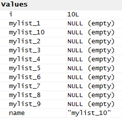
  </details>

  <details>
    <summary>2.1 generating variable names with considering sort</summary>

  ```R
  for (i in 1:10) { 
    if (i < 10) {
      name <- paste("mylist_0", i, sep = "")
    } else {
      name <- paste("mylist_", i, sep = "")
    }
    assign(name, c())
  }
  ```
  </details>

  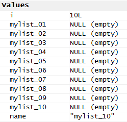

  <details>
    <summary>2.1.1 code improvement trial of 2.1</summary>

  ```R
  name_head_original = "mylist_"

  for (i in 1:10) { 
    if (i < 10) {
      name_head = paste(name_head_original, "0", sep = "")
    } else {
      name_head = name_head_original
    }
    name <- paste(name_head, i, sep = "")
    assign(name, c())
  }
  ```

  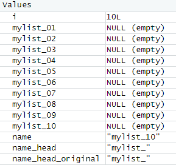

  Hmm …… is it too much?  
  It can be more clearly effective when *n* is larger, but now seems not yet.  
  </details>


## [Fibonacci Tornado (2017.05.07)](#list)

- Generating Fibonacci Series and Fibonacci Coordinates by looping

  <details>
    <summary>1. Generating Fibonacci Series</summary>

  ```R
  series <- c(1,1)
  n <- 1000                                     ## defining the length of the series

  for (i in 3:n) {
    series[i] <- series[i-2] + series[i-1]
  }

  head(series)
  ```
  </details>

  <details>
    <summary>2. Skimming the Movement of Fibonacci Coordinates</summary>

  ```
  ## The series' flow : (0,0), (1,0), (1,1), (-1,1), (-1,-2), (4,-2), ……

  ## Each Coordinate's movement :
  ## 0 : x = 0, y = 0
  ## 1 : x <- x + 1
  ## 2 : y <- y + 1
  ## 3 : x <- x - 2
  ## 4 : y <- y - 3
  ## 5 : x <- x + 5
  ```

  There are 4 types of calculation for coordinates' movement.  
  It seems possible to be realized by looping.
  </details>

  <details>
    <summary>2-1. How sort the types of calculation?</summary>

  ```
  ## type 1 : %% 4 = 1
  ## type 2 : %% 4 = 2
  ## type 3 : %% 4 = 3
  ## type 4 : %% 4 = 4
  ```
  </details>

  <details>
    <summary>3. Generating Fibonacci Coordinates by Looping</summary>

  ```R
  x <- 0
  y <- 0

  for (j in 2:n) {
    if (j %% 2 == 1) {
      x[j] <- x[j-1]
      if (j %% 4 == 1) {
        y[j] <- y[j-1] + series[j-1]  ## type 1
      } else {
        y[j] <- y[j-1] - series[j-1]  ## type 3
        }
    }
    else if (j %% 2 == 0) {
      y[j] <- y[j-1]
      if (j %% 4 == 2) {
        x[j] <- x[j-1] + series[j-1]  ## type 2
      } else {
        x[j] <- x[j-1] - series[j-1]  ## type 4
        }
    }
  }
  ```
  </details>

  <details>
    <summary>3-1. Drawing Plot</summary>

  ```R
  windows(width=5, height=5)
  plot(x[1:12], y[1:12], type="l", 
      main="Fibonacci Tornado")
  abline(h=0, v=0, col="gray", lty=3)
  ```
  </details>

  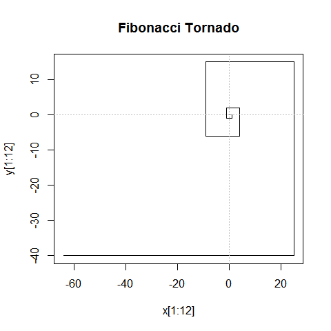


  <details>
    <summary>Bonus. Seeing it's Aproximate to the Golden Ratio</summary>

  ```R
  fibonacci.ratio <- c()

  for (k in 1:n) {
    fibonacci.ratio[k] = series[k+1]/series[k]
  }
  ```
  ```R
  windows(width=10, height=5)
  par(mfrow=c(1,2))
  plot(fibonacci.ratio[1:12],  type="l",
      main="Aproxmate to the Golden Ratio")
  abline(h=1.618, col="red", lty=3)
  plot(log(series[1:12]), type="l", 
      main="Natural Logarithm of Fibonacci Series")
  ```
  </details>

  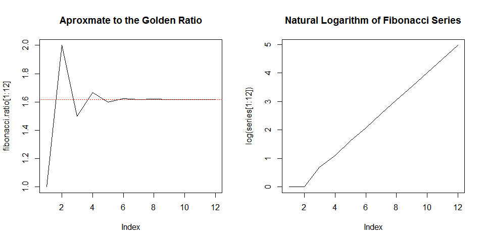