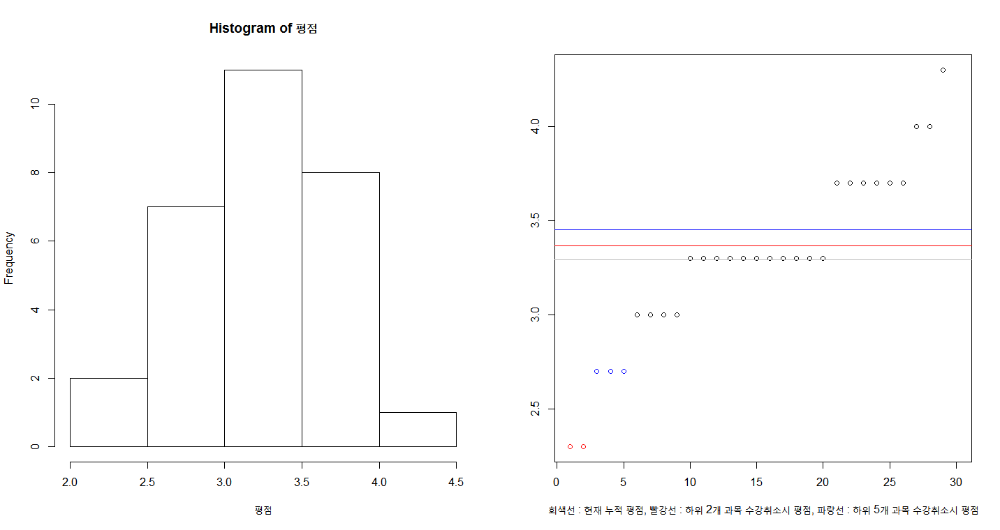
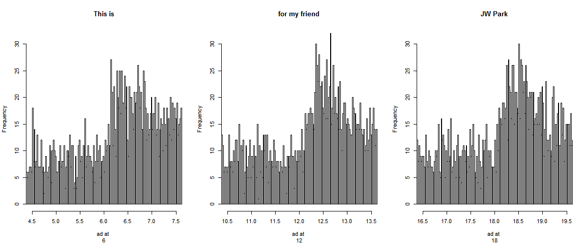
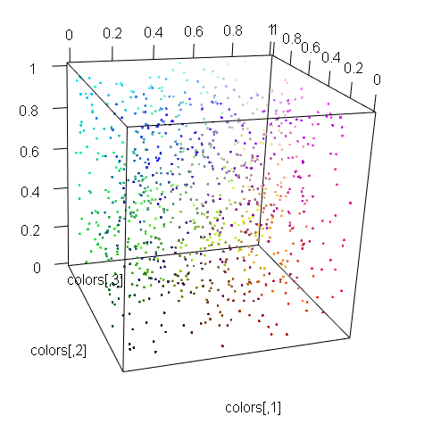
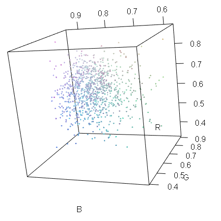
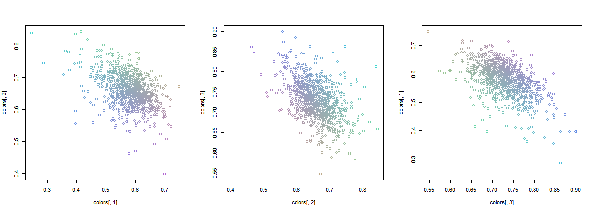

# [\[My R Practice\]](/#my-r-practice)

## List
- [`Shiny` - 1st Trial](#shiny---1st-trial)
- [Scatter Points in a Circle (2021.08.16)](#scatter-points-in-a-circle-20210816)
- [Permutations and Combinations (2021.04.05)](#permutations-and-combinations-20210405)
- [Sample Number 2 (2020.06.16)](#sample-number-2-2020616)
- Sample Number (2020.06.10)
- [Generating Array and Variables by for Loop (2019.12.06)](#generating-array-and-variables-by-for-loop-20191206)
- [Grade Cancel Effect (2019.07.19)](#grade-cancel-effect-20190719)
- [CF Affection (2019.05.25)](#cf-affection-20190525)
- [Fibonacci Tornado (2017.05.07)](#fibonacci-tornado-20170507)
- [RGB (2017.04.14)](#rgb-20170414)


## [`Shiny` - 1st Trial](#list)

- Hello Shiny

```r
if (!requireNamespace("shiny")) install.packages("shiny")
library("shiny")

runExample("01_hello")
```


## [Scatter Points in a Circle (2021.08.16)](#list)
\* Scatter points in a circle in various ways  
\* using `plotrix`

#### 0. Call "plotrix" library (install if not exist)
```R
if(!requireNamespace("plotrix")) install.packages("plotrix")
library("plotrix")
```

#### 1. Monte Carlo method 1
```R
r     = 10
n     = 30000
```
```R
rr    = runif(n, 0, r)                    # rr    : randomly sampled radius
rrad  = runif(n, 0, 2 * pi)               # rrad  : randomly sampled radian

x     = rr * cos(rrad)                    # yes, I am a math genius!
y     = rr * sin(rrad)
```
```R
windows(width = 7, height = 7)
plot(x, y, pch = '.', col = "red",
  main = "1. Monte Carlo method 1")
abline(v = -round(r*1.3):round(r*1.3), h = -r:r, col = "gray")
draw.circle(0, 0, r)                      # not exact drawing, crazy
```


#### 1.1 Fit the circle on the coordinates
```R
windows(width = 7, height = 7)
plot(x, y, pch = '.', col = "red", asp = 1, # modify asp(aspect ratio) option as 1
  main = "1.1 Monte Carlo method (with modified asp ratio)")
abline(v = -round(r*1.3):round(r*1.3), h = -r:r, col = "gray")
draw.circle(0, 0, r)
```


#### 2. Monte Carlo method 2 (disperse the crowded central population)
```R
x   = c(); y = c()
cnt = 0
```
```R
while (cnt < n)                           # insert points only in the circle
{
  temp = runif(2, -r, r)
  if (temp[1]^2 + temp[2]^2 < r^2)
  {
    x   = c(x, temp[1])
    y   = c(y, temp[2])
    cnt = cnt + 1                         # I miss ++ operator ……
  }
}
```
```R
windows(width = 7, height = 7)
plot(x, y, pch = '.', col = "red", asp = 1,
  main = "2. Monte Carlo method 2 (disperse the crowded central pop.)")
abline(v = -round(r*1.3):round(r*1.3), h = -r:r, col = "gray")
draw.circle(0, 0, r)
```


#### 3. Points with lattice spacing
```R
x         = c(); y = c()
area      = pi * r^2
interval  = sqrt(area / n)
num       = as.integer(floor(2 * r / interval))
temp      = c(-r, -r)
```
```R
for (i in 1:num)
{
  temp[1] = temp[1] + interval

  for (j in 1:num)
  {
    temp[2] = temp[2] + interval

    if (temp[1]^2 + temp[2]^2 < r^2)
    {
      x = c(x, temp[1])
      y = c(y, temp[2])
    }
  }

  temp[2] = -r
}
```
```R
length(x); length(y)
```
> [1] 29988  
> [1] 29988
```R
windows(width = 7, height = 7)
plot(x, y, pch = '.', col = "red", asp = 1,
  main = "3. Points with lattice spacing")
abline(v = -round(r*1.3):round(r*1.3), h = -r:r, col = "gray")
draw.circle(0, 0, r)
```


#### 3.1 Points with lattice spacing including outside the circle
```R
x     = c(); y = c(); xyCol = c()
temp  = c(-r, -r)
```
```R
for (i in 1:num)
{
  temp[1] = temp[1] + interval
  
  for (j in 1:num)
  {
    temp[2] = temp[2] + interval

    x = c(x, temp[1])
    y = c(y, temp[2])

    if (temp[1]^2 + temp[2]^2 < r^2) xyCol = c(xyCol,"red")
    else xyCol = c(xyCol,"blue")
  }

  temp[2] = -r
}
```
```R
length(x); length(y)
```
> [1] 38025  
> [1] 38025
```R
length(xyCol); length(xyCol[xyCol=="red"]); length(xyCol[xyCol=="blue"])
```
> [1] 38025  
> [1] 29988  
> [1] 8037
```R
windows(width = 7, height = 7)
plot(x, y, pch = '.', col = xyCol, asp = 1,
  main = "3.1 Points with lattice spacing 2")
abline(v = -round(r*1.3):round(r*1.3), h = -r:r, col = "gray")
draw.circle(0, 0, r)
```


## [Permutations and Combinations (2021.04.05)](#list)
\* get permutations and combinations  
\* using `gtools`

#### Factorial
```R
factorial(4)    # 4! = 4 * 3 * 2 * 1
```
> [1] 24

#### Permutation
```R
# loading gtools library
if (!requireNamespace("gtools")) {
    install.packages('gtools')
}
library(gtools)                             # for using permutations() and combinations()
```
```R
# ?permutations
# permutations(n, r, v=1:n, set=TRUE, repeats.allowed=FALSE)
# n                 Size of the source vector
# r                 Size of the target vectors
# v                 Source vector. Defaults to 1:n
# set               Logical flag indicating whether duplicates should be removed from the source vector v. Defaults to TRUE.
# repeats.allowed   Logical flag indicating whether the constructed vectors may include duplicated values. Defaults to FALSE.
```
```R
balls <- c("Red", "Yellow", "Blue")
```
```R
permutations(3, 2, v = balls, repeats.allowed = TRUE)  # 3Π2
```
> [1,] "Blue"   "Blue"  
> [2,] "Blue"   "Red"  
> [3,] "Blue"   "Yellow"  
> [4,] "Red"    "Blue"  
> [5,] "Red"    "Red"  
> [6,] "Red"    "Yellow"  
> [7,] "Yellow" "Blue"  
> [8,] "Yellow" "Red"  
> [9,] "Yellow" "Yellow"
```R
permutations(3, 2, v = balls, repeats.allowed = FALSE) # 3P2
permutations(3, 2, v = balls)
```
> [1,] "Blue"   "Red"  
> [2,] "Blue"   "Yellow"  
> [3,] "Red"    "Blue"  
> [4,] "Red"    "Yellow"  
> [5,] "Yellow" "Blue"  
> [6,] "Yellow" "Red"

#### Combination
```R
combn(balls, 2)
```
> [1,] "Red"    "Red"  "Yellow"  
> [2,] "Yellow" "Blue" "Blue"
```R
combinations(3, 2, v = balls, repeats.allowed = TRUE)  # 3H2
```
> [1,] "Blue"   "Blue"  
> [2,] "Blue"   "Red"  
> [3,] "Blue"   "Yellow"  
> [4,] "Red"    "Red"  
> [5,] "Red"    "Yellow"  
> [6,] "Yellow" "Yellow"
```R
combinations(3, 2, v = balls, repeats.allowed = FALSE) # 3C2
```
> [1,] "Blue" "Red"  
> [2,] "Blue" "Yellow"  
> [3,] "Red"  "Yellow"

#### Number of cases
```R
prod(4, 2)                                  # 4P2
choose(4, 2)                                # 4C2
```
> [1] 8  
> [1] 6


## [Sample Number 2 (2020.6.16)](#list)
get each branch's sample number for inspection work

```R
###################################
num = c(2, 10, 30, 50, 100) # input
length(num)

seednum = 0616 # for enhancing objectivity
rate = 0.05 # sampling ratio
###################################
```
> 5

```R
sum = 0
samplenum = c()

for (i in (1:length(num))) {
  if (i == 1) {
    set.seed(seednum)
    samplenum <- c(samplenum,
                   sample(x = 1:num[i], size = ceiling(num[i] * rate), replace = F)
                   ) 
    # at least 1 although num * rate < 1, no duplication
  } else {
    sum = sum + num[i-1]
    set.seed(seednum)
    samplenum <- c(samplenum, 
                   sample(x = (sum+1):(sum+num[i]), size = ceiling(num[i] * rate), replace =F)
                   )  
  }
}

length(samplenum) # length of the sample
print(samplenum) # print without sorting
sort(samplenum) # print with sorting
```
> [1] 12  
> [1]   2   4  14  15  74  76  45 124 126 159 167 120  
> [1]   2   4  14  15  45  74  76 120 124 126 159 167


#### Test
```R
sum = 0

for (i in (1:length(num))) {
  if (i == 1 ) {
    print(num[i])
  } else {
    sum = sum + num[i-1]
    print(paste(num[i], sum, sum + num[i]))
  }
}
```
> [1] 2  
> [1] "10 2 12"  
> [1] "30 12 42"  
> [1] "50 42 92"  
> [1] "100 92 192"

```R
ceiling(3/10) # rounding up
```
> 1


## [Generating Array and Variables by for Loop (2019.12.06)](#list)
answer for a question at chatting room  
\* R array-related data structure is actually defined as vector, matrix and array about each dimension's array.  
\* I call it just 'array' by common mathematical notion here, but it is different from R's strict data structure definition.  

```R
# 1. generating array by for loop
mylist = c()

for (i in 1:10) {
  mylist[i] = i
}

mylist
```
>  [1]  1  2  3  4  5  6  7  8  9 10

```R
# 1.1 generating array more efficiently
mylist2 = c(1:10)

mylist2
```
>  [1]  1  2  3  4  5  6  7  8  9 10

```R
# 2. generating variable names
for (i in 1:10) { 
  name <- paste("mylist_", i, sep = "")
  assign(name, c())
}

```


```R
# 2.1 generating variable names with considering sort
for (i in 1:10) { 
  if (i < 10) {
    name <- paste("mylist_0", i, sep = "")
  } else {
    name <- paste("mylist_", i, sep = "")
  }
  assign(name, c())
}
```


```R
# 2.1.1 code improvement trial of 2.1

name_head_original = "mylist_"

for (i in 1:10) { 
  if (i < 10) {
    name_head = paste(name_head_original, "0", sep = "")
  } else {
    name_head = name_head_original
  }
  name <- paste(name_head, i, sep = "")
  assign(name, c())
}
```
  
Hmm …… is it too much?  
It can be more clearly effective when *n* is larger, but now seems not yet.  


## [Grade Cancel Effect (2019.07.19)](#list)
try simulating grade cancel effect for my sister
1) generate grade data (because my sister's real GPA can't be opened.ㅋㅋ)
2) plot

#### 1. generating grade data
```R
# 1.1 grade (4.3 Scale)
g0 <- 1:4
gp <- g0 + 0.3
gm <- g0 - 0.3
g <- sort(c(g0, gp, gm))
g
```
> 0.7 1.0 1.3 1.7 2.0 2.3 2.7 3.0 3.3 3.7 4.0 4.3

```R
# 1.2 more compact
g <- sort(c(1:4, 1:4+0.3, 1:4-0.3))
g
```
> 0.7 1.0 1.3 1.7 2.0 2.3 2.7 3.0 3.3 3.7 4.0 4.3

```R
# 1.3 test simply matching by slicing
g[9]
g[10]
g[9.5]
g[9.152346]
g[9.876312] # It works but calls values smaller (biased)
```
> 3.3  
> 3.7  
> 3.3  
> 3.3  
> 3.3

```R
# 1.4 generate random grade data
set.seed(307)
평점 <- g[rnorm(30, 9.5, 1.5)]
str(평점)
```
> num [1:30] 3.7 3 2.3 2.3 NA 3 3.7 3.3 3 3.3 ...

#### 2. plot
```R
len <- length(sort(평점))
windows(width=15, height=8)
  par(mfrow=c(1,2)) 
    hist(평점)
    plot(평점~rank(평점, ties.method="first"),
      xlab = "회색선 : 현재 누적 평점, 빨강선 : 하위 2개 과목 수강취소시 평점, 파랑선 : 하위 5개 과목 수강취소시 평점",
      ylab = "",
      col = c(rep(2,2), rep(4,3), rep(1,len-2-3))[rank(평점, ties.method="first")]
    )
      abline(h=mean((평점), na.rm=TRUE), col="gray")
      abline(h=mean(sort(평점)[3:len]), col="red")
      abline(h=mean(sort(평점)[6:len]), col="blue")
```



```R
# 2.1 values
mean(평점) # NA. na.rm=TRUE 넣어줘야 함
mean(평점, na.rm=TRUE)
mean(sort(평점)[6:len])
mean(sort(평점)[9:len])    
```
> NA  
> 3.293103  
> 3.45  
> 3.514286


## [CF Affection (2019.05.25)](#list)
\* For my friend JW Park who wants to measure the affection of TV CF  
\* It demands simply CF time schedule and target frequency(ex. app download time), not heavy tracker.

#### 1. Generating Sample Data
```R
n1 = 24*60  # 24 hours * 60 minutes
n2 = 18*60  # not used - suppose 18:00pm is the peak with normal dist.
cf.time = c(6, 12, 18) # suppose cf is played at 6:00, 12:00 and 18:00)
jwp = c("This is", "for my friend", "JW Park") # suprise!

# 1-1. set an uniform dist. frequency of app download
sample.data = runif(10000, 0, n1)/60

# 1-2. add the frequency just after cf
for (i in 1:length(cf.time)) {
  sample.data = c(sample.data, rlnorm(1000, 0, 1) + cf.time[i])
  }
# It can be more plausible with your wit

# 1-3. adjust time ex) 25:00 → 01:00
for (i in 1:length(sample.data)) {
  if (sample.data[i] >= 24) {
    sample.data[i] = sample.data[i] %% 24
  }
}
```

#### 2. plot histogram for comparing before and after ad.
```R
windows(width=12, height=5)
par(mfrow=c(1,3)) 
for (i in 1:length(cf.time)) {
  hist(sample.data, 
       main = jwp[i],
       xlim = range(cf.time[i]-1.5, cf.time[i]+1.5),
       xlab = c("ad at ", cf.time[i]),
       breaks=n1)
}
```



## [Fibonacci Tornado (2017.05.07)](#list)
generating Fibonacci Series and Fibonacci Coordinates by looping

#### 1. Generating Fibonacci Series

```R
series <- c(1,1)
n <- 1000                                     ## defining the length of the series

for (i in 3:n) {
  series[i] <- series[i-2] + series[i-1]
}

head(series)
```

#### 2. Skimming the Movement of Fibonacci Coordinates
```
## The series' flow : (0,0), (1,0), (1,1), (-1,1), (-1,-2), (4,-2), ……

## Each Coordinate's movement :
## 0 : x = 0, y = 0
## 1 : x <- x + 1
## 2 : y <- y + 1
## 3 : x <- x - 2
## 4 : y <- y - 3
## 5 : x <- x + 5
```

There are 4 types of calculation for coordinates' movement.
It seems possible to be realized by looping.

#### 2-1. How sort the types of calculation?
```
## type 1 : %% 4 = 1
## type 2 : %% 4 = 2
## type 3 : %% 4 = 3
## type 4 : %% 4 = 4
```

#### 3. Generating Fibonacci Coordinates by Looping
```R
x <- 0
y <- 0

for (j in 2:n) {
  if (j %% 2 == 1) {
    x[j] <- x[j-1]
    if (j %% 4 == 1) {
      y[j] <- y[j-1] + series[j-1]  ## type 1
    } else {
      y[j] <- y[j-1] - series[j-1]  ## type 3
      }
  }
  else if (j %% 2 == 0) {
    y[j] <- y[j-1]
    if (j %% 4 == 2) {
      x[j] <- x[j-1] + series[j-1]  ## type 2
    } else {
      x[j] <- x[j-1] - series[j-1]  ## type 4
      }
  }
}
```

#### 3-1. Drawing Plot
```R
windows(width=5, height=5)
plot(x[1:12], y[1:12], type="l", 
     main="Fibonacci Tornado")
abline(h=0, v=0, col="gray", lty=3)
```


#### Bonus. Seeing it's Aproximate to the Golden Ratio.

```R
fibonacci.ratio <- c()

for (k in 1:n) {
  fibonacci.ratio[k] = series[k+1]/series[k]
}
```
```R
windows(width=10, height=5)
par(mfrow=c(1,2))
plot(fibonacci.ratio[1:12],  type="l",
     main="Aproxmate to the Golden Ratio")
abline(h=1.618, col="red", lty=3)
plot(log(series[1:12]), type="l", 
     main="Natural Logarithm of Fibonacci Series")
```


## [RGB (2017.04.14)](#list)
\* showing RGB color data' distribution by several methods in R  
\* using `plot3d()`, converting on coordinate plane  
\* generating RGB data with a sigmoid function

```R
## Install required library packages (only at first)
install.packages("rgl")

## Loading required libraries
library(rgl)
```

#### Generate sample data by Uniform dist.
```R
colors <- matrix(c(runif(3000)), ncol=3)
tail(colors)

plot3d(colors, col=rgb(colors))
```



#### Using Sigmoid function
Reference : https://en.wikipedia.org/wiki/Sigmoid_function
```R
R <- rnorm(1000, 64, 50)
G <- rnorm(1000, 128, 50)
B <- rnorm(1000, 192, 50)

colors <- (tanh(cbind(R,G,B)/255)+1)/2
summary(colors)

plot3d(colors, col=rgb(colors))
```



#### Using Sigmoid function 2 (Plotting on coordinate plane)
Reference : https://github.com/THEjoezack/ColorMine/blob/master/ColorMine/ColorSpaces/Conversions/YxyConverter.cs

```R
R2 = R/(R+G+B)
G2 = G/(R+G+B)
B2 = B/(R+G+B)

colors <- (tanh(cbind(R2,G2,B2))+1)/2
summary(colors)

par(mfrow=c(1,3))
plot(colors[,1], colors[,2], col=rgb(colors))
plot(colors[,2], colors[,3], col=rgb(colors))
plot(colors[,3], colors[,1], col=rgb(colors))
```

