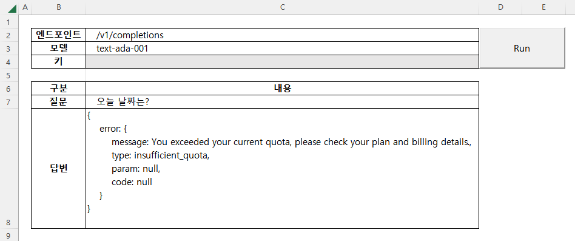
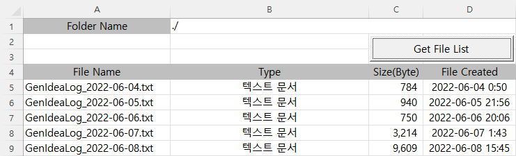
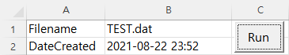
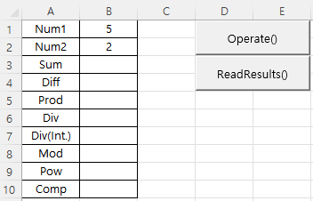
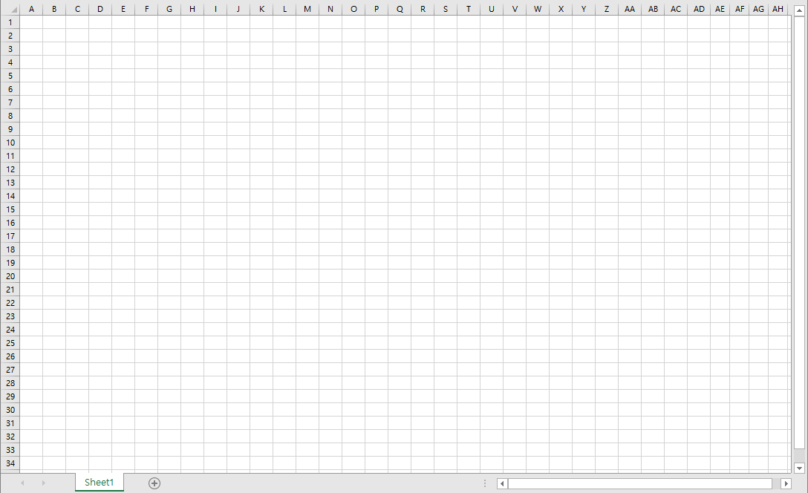
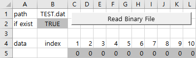
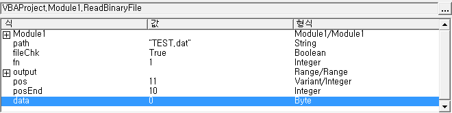
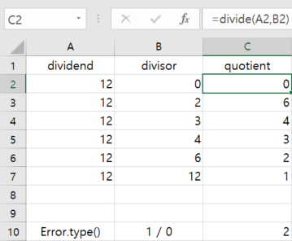
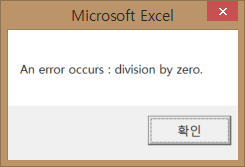

# [My VBA Practice](../README.md#my-vba-practice)

VBA, maybe it could be my ancient future


### \<List>

- [*ChatGPT* : Simple Q&A Trial (2023.05.02)](#chatgpt--simple-qa-trial-20230502)
- [`Erase` Statement (2023.01.03)](#erase-statement-20230103)
- [File System : `Folder.Files` (2022.07.15)](#folder-object--files-property-20220715)
- [File System : `File.DateCreated` (2022.07.12)](#file-object--datecreated-property-20220712)
- [`ByRef` vs `ByVal` (2022.06.05)](#byref-vs-byval-20220605)
- [Declare Plural Variable (2022.06.04)](#declare-plural-variable-20220604)
- [Color Scroll 2 (2021.12.01)](#color-scroll-2-20211201)
- [Variable Scope (2011.11.29)](#variable-scope-20111129)
- [Control Formula Calculation Option (2021.11.08)](#control-formula-calculation-option-20211108)
- [Read Binary File (2021.08.23)](#read-binary-file-20210823)
- [Try ~ Catch ~ Finally (2021.07.28)](#try-catch-finally-20210728)
- [Color Scroll (2020.11.14)](#color-scroll-20201114)


## [*ChatGPT* : Simple Q&A Trial (2023.05.02)](#list)

- Although the code appears to be working properly, the issue seems to be related to the failure of making a **payment** after the end of the Free trial usage of the *ChatGPT API*.
- While the problem can be resolved by making a payment, I will pause the phase here as a commemoration of the failure.

  

  <details>
    <summary>Codes : ChatGPT_QA_0.bas</summary>

  ```vba
  Option Explicit
  ```
  ```vba
  Private Type CellLocationsType

      endpoint As String
      model As String
      apiKey As String
      question As String
      answerRange As Range                                    ' Not String but Range

  End Type
  ```
  ```vba
  Private Sub SetCellLocations(ByRef thisType As CellLocationsType)

      thisType.endpoint = Range("C2").Value
      thisType.model = Range("C3").Value
      thisType.apiKey = Range("C4").Value
      thisType.question = Range("C7").Value
      Set thisType.answerRange = Range("C8")                  ' Don't forget `set`!

  End Sub
  ```
  ```vba
  Private Sub ChatGPT()

      Dim CellLocations As CellLocationsType
      Dim request As Object
      Dim request_body As String
      Dim response As String

      ' Set required data
      Call SetCellLocations(CellLocations)

      ' Clear the Answer cell
      CellLocations.answerRange.Value = ""

      ' Request ChatGPT API
      Set request = CreateObject("WinHttp.WinHttpRequest.5.1")
      request.Open "POST", "https://api.openai.com/" & CellLocations.endpoint, False
      request.SetRequestHeader "Content-Type", "application/json"
      request.SetRequestHeader "Authorization", "Bearer " & CellLocations.apiKey
      request_body = "{" & _
          """prompt"": """ & Replace(CellLocations.question, """", "\""") & """," & _
          """model"": """ & CellLocations.model & """," & _
          """max_tokens"": 4097," & _
          """n"": 1," & _
          """stop"": [""\n""]" & _
      "}"
      Debug.Print request_body
      request.Send request_body

      ' Output
      response = Replace(request.ResponseText, Chr(34), "")
      response = Replace(response, "\n", "")
      Debug.Print response
      CellLocations.answerRange.Value = response

  End Sub
  ```
  ```vba
  Private Sub btnRun_Click()

          Application.Calculation = xlManual
              Call ChatGPT
          Application.Calculation = xlAutomatic

  End Sub
  ```
  </details>

  


## [`Erase` Statement (2023.01.03)](#list)

- Practices to use `Erase` for a **static array** and a **dynamic array**
  - `Erase Static Array` : just fills all the cells as 0
  - `Erase Dynamic Array` : completely sets it back as *Type()*

  <details>
    <summary>Codes : Erase.bas</summary>

  ```vba
  Option Explicit


  Private Sub Main()

      Dim T800(1 To 9)    As Integer
      Dim T1000()         As Integer

      Dim i As Integer, j As Integer, str As String

      ' 1. Static Array
      ' 1.1 Fill the array
      For i = 1 To 9
          T800(i) = i
      Next i

      ' 1.2 Print the array
      str = ""
      For i = 1 To 9
          str = str & T800(i)
      Next i
      Debug.Print str                                         ' 123456789

      ' 1.3 Erase the fixed array
      Erase T800

      ' 1.4 Print the array after erased
      str = ""
      For i = 1 To 9
          str = str & T800(i)
      Next i
      Debug.Print str                                         ' 000000000

      ' 2. Dynamic Array
      ' 2.1 Fill the array
      ReDim T1000(1 To 9)
      For i = 1 To 9
          T1000(i) = i
      Next i

      ' 2.2 Print the array
      str = ""
      For i = 1 To 9
          str = str & T1000(i)
      Next i
      Debug.Print str                                         ' 123456789

      ' 2.3 Erase the fixed array
      Erase T1000                                             ' become Integer()

      ' 2.4 Print the array after erased
  '    str = ""
  '    For i = 1 To 9
  '        str = str & T1000(i)                               ' error
  '    Next i
  '    Debug.Print LBound(T1000) & " " & UBound(T1000)        ' error

  End Sub
  ```
  ```
  123456789
  000000000
  123456789
  ```
  </details>

## [File System : `Folder.Files` (2022.07.15)](#list)

- Get a file list from a folder through `Folder` object in VBA
- Reference : [[Microsoft Docs] VBA > Objects > Folder Object](https://docs.microsoft.com/en-us/office/vba/language/reference/user-interface-help/folder-object)

  

  <details>
    <summary>Codes : File_GetFolders.bas</summary>

  ```vba
  Option Explicit
  ```
  ```vba
  Sub GetFileList()

      ' Set zero point to print
      Dim printZero As Range
      Set printZero = Range("A5")

      ' Clear area to print
      Dim usingArea As Range
      Set usingArea = Range(printZero, printZero.Offset(10000, 3))
      usingArea.ClearContents

      ' Get path
      Dim path As String
      If Range("B1").Value <> "" Then
          path = Range("B1").Value
      Else
          path = ThisWorkbook.path & Application.PathSeparator
      End If
          ' Debug.Print path

      ' Get oFile collection's informations
      Dim oFSO, oFolder, oFile
      Dim i As Integer
      Set oFSO = CreateObject("Scripting.FileSystemObject")
      Set oFolder = oFSO.GetFolder(path)
          ' Debug.Print oFolder.Name
      For Each oFile In oFolder.Files                                             ' .Files property returns a Files collection consisting of all File objects
          printZero.Offset(i, 0) = oFile.Name
          printZero.Offset(i, 1) = oFile.Type
          printZero.Offset(i, 2) = oFile.Size
          printZero.Offset(i, 3) = oFile.DateCreated
          i = i + 1
      Next oFile

  End Sub
  ```
  ```vba
  Private Sub btnGetFileList_Click()

      Application.Calculation = xlManual
          Call GetFileList
      Application.Calculation = xlAutomatic

  End Sub
  ```
  </details>


## [File System : `File.DateCreated` (2022.07.12)](#list)

- Read the `DateCreated` property from an external file through `File` object in VBA
- Reference : [[Microsoft Docs] VBA > Objects > File Object](https://docs.microsoft.com/en-us/office/vba/language/reference/user-interface-help/file-object)

  

  <details>
    <summary>Codes : File_DateCreated.bas</summary>

  ```vba
  Option Explicit
  ```
  ```vba
  Sub ReadDateCreated()

      Dim fs, f, s
      Dim path As String
      path = ThisWorkbook.path & Application.PathSeparator & Range("B1").Value
          'Debug.Print path
      Set fs = CreateObject("Scripting.FileSystemObject")
      Set f = fs.GetFile(path)
      s = f.DateCreated

      Range("B2").Value = s

  End Sub
  ```
  ```vba
  Private Sub btnReadDateCreated_Click()

      Application.Calculation = xlManual
          Call ReadDateCreated
      Application.Calculation = xlAutomatic

  End Sub
  ```
  </details>


## [`ByRef` vs `ByVal` (2022.06.05)](#list)

- One more technical issue, following the below topic, raised from [Idea Generator v0.20 (2022.06.03)](https://github.com/kimpro82/MyFamilyCare/tree/main/IdeaGenerator#idea-generator-v020-20220603)
- Don't ignore VBA users! We also understand the difference between **Call by Reference** and **Call by Value**!
- Further discussion  
  · [[Microsoft Docs] VB.NET > Passing Arguments by Value and by Reference](https://docs.microsoft.com/en-us/dotnet/visual-basic/programming-guide/language-features/procedures/passing-arguments-by-value-and-by-reference)  
  · [[Microsoft Docs] VBA > Array argument must be ByRef](https://docs.microsoft.com/en-us/office/vba/language/reference/user-interface-help/array-argument-must-be-byref)  
  · [[Microsoft Docs] VBA > Understanding parameter arrays](https://docs.microsoft.com/en-us/office/vba/language/concepts/getting-started/understanding-parameter-arrays)


  <details>
    <summary>Codes : ByRef_vs_ByVal.bas</summary>

  ```vba
  Option Explicit
  ```
  ```vba
  Private Function fByRef(ByRef s As String)

      s = "바보"

  End Function
  ```
  ```vba
  Private Function fByVal(ByVal s As String)                  ' An array as a parameter can't be called by Value

      s = "바보"

  End Function
  ```
  ```vba
  Private Sub Main()

      Dim 마누라(1) As String
      Dim 남편(1) As String

      마누라(0) = "마누라"
      마누라(1) = "최고"
      남편(0) = "남편"
      남편(1) = "최고"

      Call fByRef(마누라(1))
      Call fByVal(남편(1))

      Debug.Print 마누라(0) & "는 " & 마누라(1) & "다."
      Debug.Print 남편(0) & "은 " & 남편(1) & "다."

  End Sub
  ```
  </details>

  > 마누라는 바보다.  
  > 남편은 최고다.


## [Declare Plural Variable (2022.06.04)](#list)

- A technical issue raised from [Idea Generator v0.20 (2022.06.03)](https://github.com/kimpro82/MyFamilyCare/tree/main/IdeaGenerator#idea-generator-v020-20220603)
- **Every variable should be specified individually as its type although they are declared in a line.**
- In the below cases, the result `0` means `Empty (uninitialized)` and `2` does `Integer` from `VarType()`.  
  ※ Reference ☞ [[Microsoft Docs] VBA > VarType function > Return values](https://docs.microsoft.com/en-us/office/vba/language/reference/user-interface-help/vartype-function#return-values)

  <details>
    <summary>Codes : DeclarePluralVariable.bas</summary>

  ```vba
  Option Explicit
  ```

  ```vba
  Private Sub StupidDeclare()

      Dim a, b As Integer

      Debug.Print VarType(a) & " " & VarType(b)

  End Sub
  ```
  > 0 2

  ```vba
  Private Sub SmartDeclare()

      Dim a As Integer, b As Integer

      Debug.Print VarType(a) & " " & VarType(b)

  End Sub
  ```
  > 2 2
  </details>


## [Color Scroll 2 (2021.12.01)](#list)

- Advanced from [Color Scroll (2020.11.14)](#color-scroll-20201114) : succeed in making it move!
- Use `array` `Application.Calculation` `RGB()`, without `Select`/`Selection`

  

  <details>
    <summary>Codes : ColorScroll2.bas</summary>

  ```vba
  Option Explicit

  'Private Declare PtrSafe Sub Sleep Lib "kernel32" (ByVal Milliseconds As LongPtr)   ' actually it is somewhat crazy to declare it as Private
  ```

  ```vba
  Sub ColorScroll2()

      Dim width, interval As Integer
      Dim base(2), rgbCol(2) As Integer                                               ' 2 means 0 to 2 (size : 3)

      width = 96
      interval = 16

      base(0) = 0
      base(1) = 127
      base(2) = 255

      Dim i, j, k As Integer

      ' shift i times
      For i = 1 To 100

          Application.Calculation = xlManual

              ' i-th drawing
              For j = 1 To width

                  ' for base(0 ~ 2)
                  For k = 0 To 2

                      If (base(k) \ 256) Mod 2 = 0 Then                               ' / : don't operate as int / int
                          rgbCol(k) = base(k) Mod 256
                      Else
                          rgbCol(k) = 256 - (base(k) Mod 256)
                      End If

                      ' test
                      'Cells(2 + k, j) = rgbCol(k)

                      base(k) = base(k) + interval

                  Next k

                  Cells(1, j).Interior.Color = RGB(rgbCol(0), rgbCol(1), rgbCol(2))   ' not .ColorIndex

              Next j

          Application.Calculation = xlAutomatic

          base(0) = base(0) + interval                                                ' is it the best?
          base(1) = base(1) + interval
          base(2) = base(2) + interval

  '        Sleep (100)

      Next i

  End Sub
  ```

  ```vba
  Sub Reset()
  'Initialize the sheet

      Cells.Select
      Selection.Clear

      Selection.ColumnWidth = 1
      Selection.RowHeight = 10
      Cells(1, 1).RowHeight = 409                                                     ' 409 : the max row height supported by Excel

  End Sub
  ```
  </details>


## [Variable Scope (2011.11.29)](#list)

- Load several operation results into `Public` variables and call them into local `Sub` procedure
- I don't think it is an enough practice but my front line now here ……

  

  <details>
    <summary>Codes : Scope.bas</summary>

  ```vba
  '----------------------------------------------------------------------------------------
  ' Module1
  Option Explicit


  Public num1, num2, res(7) As Integer


  Sub Operate()

      num1 = ActiveSheet.Range("B1")
      num2 = ActiveSheet.Range("B2")

      res(0) = num1 + num2
      res(1) = num1 - num2
      res(2) = num1 * num2
      res(3) = num1 / num2
      res(4) = num1 \ num2                                        ' no difference from '/' because of Integer / Integer
      res(5) = num1 Mod num2
      res(6) = num1 ^ num2
      res(7) = num1 >= num2                                       ' why -1 when num1 = 5, num2 = 2?

  End Sub
  ```

  ```vba
  '----------------------------------------------------------------------------------------
  ' Sheet1
  Sub ReadResults()

      Dim i As Integer
      For i = 0 To 7
          ActiveSheet.Range("B" & 3 + i) = res(i)
      Next i

  '    Range("B3:B10").Value = res                                ' why doesn't it work?
  '    Range("B3:B10").Value = WorksheetFunction.Transpose(res)   ' it works but I want to avoid WorkSheetFunction() if possible

  End Sub
  ```
  </details>


## [Control Formula Calculation Option (2021.11.08)](#list)

- Control **Excel's formula calculation option** by `Application.Calculation` method
- Working with `xlManual` status is much faster than `xlAutomatic`

  

  <details>
    <summary>Codes : FormulaCalcOption.bas</summary>

  ```VBA
  Option Explicit
  ```
  ```VBA
  ' Make a sample case that contains many calculations
  Sub sampleWork()

      ' Set range
      Dim row, rowEnd, col, colEnd As Integer
      row = 1
      rowEnd = 34
      col = row
      colEnd = rowEnd

      ' Generate formula n * n times
      While row <= rowEnd
      
          While col <= colEnd

              If (row = rowEnd And col = colEnd) Then
                  Sheet1.Cells(row, col) = rowEnd * 3 - 3
              ElseIf (col = colEnd) Then
                  Sheet1.Cells(row, col).FormulaR1C1 = "=R[+1]C-3"    ' 삼천포 you nahm sayin
              Else
                  Sheet1.Cells(row, col).FormulaR1C1 = "=RC[+1]-3"
              End If

              col = col + 1

          Wend

          col = 1
          row = row + 1

      Wend

  End Sub
  ```
  </details>

  

  <details>
    <summary>Codes : FormulaCalcOption.bas</summary>

  ```VBA
  ' Skip excel formula calculation temporarily
  Sub SkipFormulaCalc()

      Application.Calculation = xlManual
          Call sampleWork
      Application.Calculation = xlAutomatic
      
  End Sub
  ```
  </details>


## [Read Binary File (2021.08.23)](#list)

- Use `Open ~ For ~ As` statement
- `path` requires absoulte one

  <details>
    <summary>Codes : ReadBinaryFile.bas - Trial 1</summary>

  ```vba
  Option Explicit


  Sub ReadBinaryFile()

      'Call the target file's path that user entered
      Dim path As String
      path = Range("B1")

      'Check if the file exists
      Dim fileChk As Boolean                      'default : False
      If (Len(Dir(path)) > 0) Then fileChk = True
      Range("B2") = fileChk

      Dim fn As Integer                           'fn : file number
      fn = FreeFile

      Dim output As Range
      Set output = Range("B5")                    'set offset location for output

      Open path For Binary Access Read As #fn
      
          Dim pos, posEnd As Integer
          pos = 1
          posEnd = 10
          
          Dim data As Byte

          While pos <= posEnd
              Get #fn, pos, data
              output.Offset(0, pos).Value = data
              pos = pos + 1
          Wend

      Close #fn

  End Sub
  ```
  ☞ `data` doesn't work well.
  </details>

  

  

  <details>
    <summary>Codes : ReadBinaryFile.bas - Trial 2</summary>

  ☞ receive advice from [Can't read binary file data (StackOverflow)](https://stackoverflow.com/questions/68892076/cant-read-binary-file-data)

  Before :
  ```vba
  path = Range("B1")
  ```

  After : 
  ```vba
  path = ThisWorkbook.path & Application.PathSeparator & Range("B1")
  ```
  </details>

  


## [Try Catch Finally (2021.07.28)](#list)

- Use `Try ~ Catch ~ Finally` statement in VBA
- Actually VBA doesn't support it officially, but we can imitate it with **label** based on `GoTo` grammar.

  

  

  <details>
    <summary>Codes : TryCatchFinally.bas</summary>

  ```vba
  Option Explicit


  Function Divide(a As Integer, b As Integer) As Integer

  Try:                                                ' the below lines will run regardless of this
      
      On Error GoTo Catch
          Divide = a / b                              ' occurs en error when b = 0 or any possible cases (I can't imagine but ……)
      
      GoTo Finally                                    ' pass Catch: when it doesn't occur an error
      
  Catch:
      
      If b = 0 Then
          MsgBox "An error occurs : division by zero."
  '    Else                                           ' When b is not entered, it calls 0 as a default value.
  '        MsgBox "An error occurs."
      End If
      
      Exit Function                                   ' need not to run under Finally:

  Finally:
      
      MsgBox Divide                                   ' I have no any other idea to use Finally:

  End Function
  ```
  </details>


## [Color Scroll (2020.11.14)](#list)

- Make a color matrix by `Nested For` statement
- Want to make it flow, but it doesn't work well yet

  

  <details>
    <summary>Codes : ColorScroll.bas</summary>

  ```vba
  Option Explicit
  ```
  ```vba
  Sub ColorScroll()

      Dim StartRow As Integer, StartColumn As Integer, Width As Integer, Height As Integer
      Dim i As Integer, j As Integer, k As Integer
      Dim FirstColumn As Range, LastColumn As Range

      StartRow = 1
      StartColumn = 1
      Width = 56
      Height = 56

      Range(Cells(StartRow, StartColumn), Cells(Height, Width)).Select
      Selection.RowHeight = 10
      Selection.ColumnWidth = 1

      For i = 1 To Height
          For j = 1 To Width
              Cells(i, j).Interior.ColorIndex = (i + j) Mod 56 + 1
          Next j
      Next i

  '    Differnt result from debugging mode and normal run mode(F5)
  '    For k = 1 To Width
  '        Columns(Width).Select
  '        Selection.Cut
  '        Columns(1).Select
  '        Selection.Insert Shift:=xlToRight
  '    Next k

  End Sub
  ```
  ```vba
  Sub Reset()
  'Initialize the sheet

      Cells.Select
      Selection.Clear

      Selection.ColumnWidth = 10
      Selection.RowHeight = 15

  End Sub
  ```
  </details>