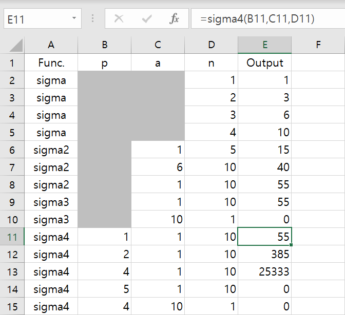
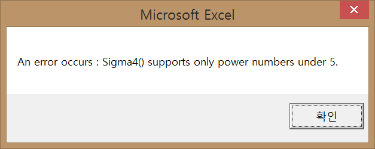
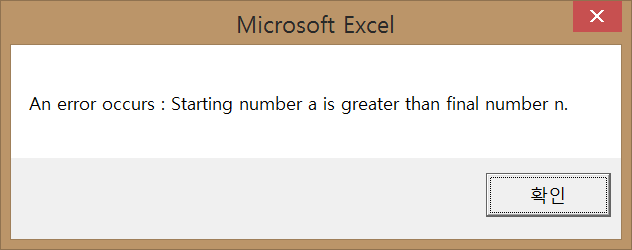
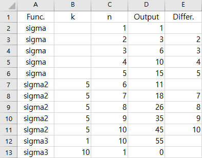
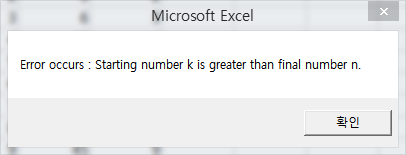
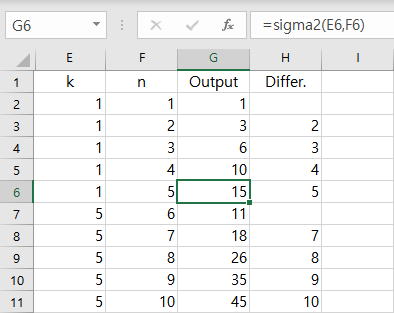
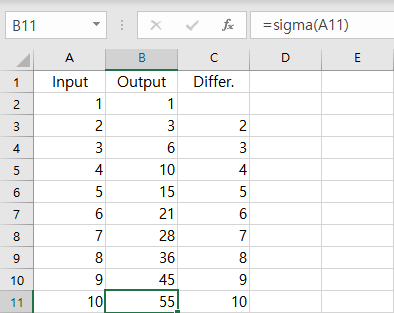

# My VBA Practice

VBA, maybe it could my ancient future

- Sigma4 (2021.07.26)
- Sigma3 (2021.07.07)
- Sigma2 (2021.01.03)
- Sigma (2021.01.02)
- Color_Scroll (2020.11.14)


## Sigma4 (2021.07.26)

- Change the calculation method from loop to **[Faulhaber's Formula](https://en.wikipedia.org/wiki/Faulhaber%27s_formula)** (make faster)
- Support operations for k ~ k^4







```vba
Option Explicit

Function Sigma4(p As Integer, a As Integer, n As Integer) As Integer

    On Error GoTo ErrorHandler1

        If a > n Then
            Err.Raise 380   'Error Code 380 : Invalid property value.
        End If

    On Error GoTo ErrorHandler2

        Dim sum As Integer

        If p = 1 Then
            sum = n * (n + 1) / 2 - (a - 1) * a / 2
        ElseIf p = 2 Then
            sum = n * (n + 1) * (2 * n + 1) / 6 - (a - 1) * a * (2 * (a - 1) + 1) / 6
        ElseIf p = 3 Then
            sum = (n * (n + 1) / 2) ^ 2 - ((a - 1) * a / 2) ^ 2
        ElseIf p = 4 Then
            sum = n * (n + 1) * (2 * n + 1) * (3 * n ^ 2 + 3 * n - 1) / 30 - (a - 1) * a * (2 * (a - 1) + 1) * (3 * (a - 1) ^ 2 + 3 * (a - 1) - 1) / 30
        Else                'When p > 4
            Err.Raise 380
        End If

        Sigma4 = sum
    
    Exit Function

ErrorHandler1:

        MsgBox "An error occurs : Starting number a is greater than final number n."

    Exit Function

ErrorHandler2:

        MsgBox "An error occurs : Sigma4() supports only power numbers under 5."

End Function
```


## Sigma3 (2021.07.07)

- Add **Error Handler** 
- How about naming labels such like `try` ~ `catch` ~ `finally`?





```vba
Option Explicit


Function Sigma3(k As Integer, n As Integer) As Integer

    On Error GoTo ErrorHandler

    If k > n Then
        Err.Raise 380   'Error Code 380 : Invalid property value.
    End If

    Dim i As Integer, Sum As Integer

    For i = k To n      'including both of k and n
        Sum = Sum + i
    Next i

    Sigma3 = Sum
    
    Exit Function
    

ErrorHandler:
    
    MsgBox "Error occurs : Starting number k is greater than final number n."
    
End Function
```


## Sigma2 (2021.01.03)

- Add a parameter of _k_ that indicates a starting point
- Need to add codes for handling errors.



```vba
Option Explicit


Function Sigma2(k As Integer, n As Integer) As Integer

    Dim i As Integer, Sum As Integer

    For i = k To n
        Sum = Sum + i
    Next i

    Sigma2 = Sum

End Function
```


## Sigma (2021.01.02)

- Make a function to calculate `summation` (a.k.a. Sigma, Σ)
- Define all the variables as `integer`



```vba
Option Explicit


Function Sigma(n As Integer) As Integer

    Dim i As Integer, Sum As Integer

    For i = 1 To n
        Sum = Sum + i
    Next i

    Sigma = Sum

End Function
```


## Color_Scroll (2020.11.14)

- Make a color matrix by `Nested For` statement
- Want to make it flow, but it doesn't work well yet


```vba
Option Explicit

Sub Color_Scroll()

    Dim StartRow As Integer, StartColumn As Integer, Width As Integer, Height As Integer
    Dim i As Integer, j As Integer, k As Integer
    Dim FirstColumn As Range, LastColumn As Range
    
    StartRow = 1
    StartColumn = 1
    Width = 56
    Height = 56
        
    Range(Cells(StartRow, StartColumn), Cells(Height, Width)).Select
    Selection.RowHeight = 10
    Selection.ColumnWidth = 1
    
    For i = 1 To Height
        For j = 1 To Width
            Cells(i, j).Interior.ColorIndex = (i + j) Mod 56 + 1
        Next j
    Next i
    
'Differnt result from debugging mode and normal run mode(F5)
'    For k = 1 To Width
'        Columns(Width).Select
'        Selection.Cut
'        Columns(1).Select
'        Selection.Insert Shift:=xlToRight
'    Next k
    
End Sub
```

```vba
Sub Reset()
'Initialize the sheet

    Cells.Select
    Selection.Clear
    
    Selection.ColumnWidth = 10
    Selection.RowHeight = 15

End Sub
```